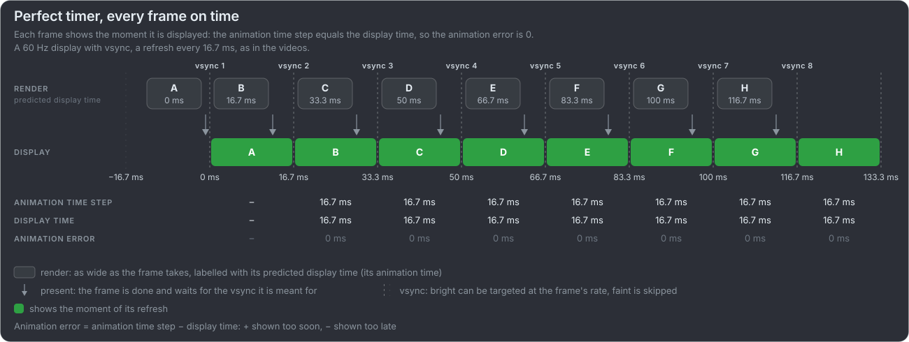
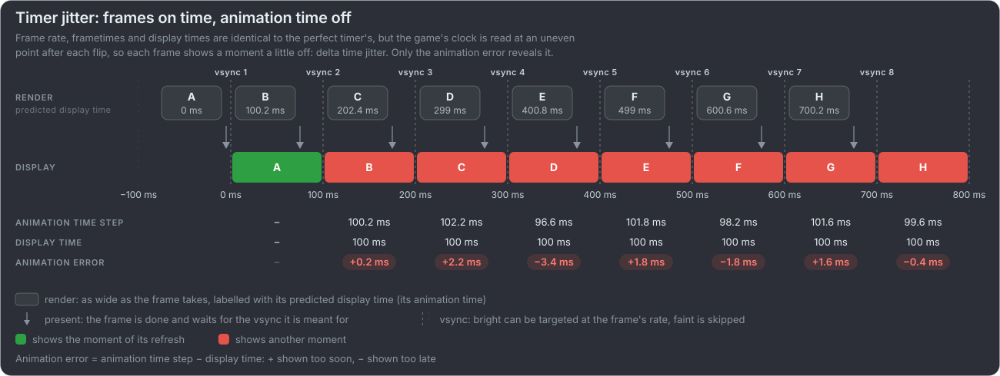
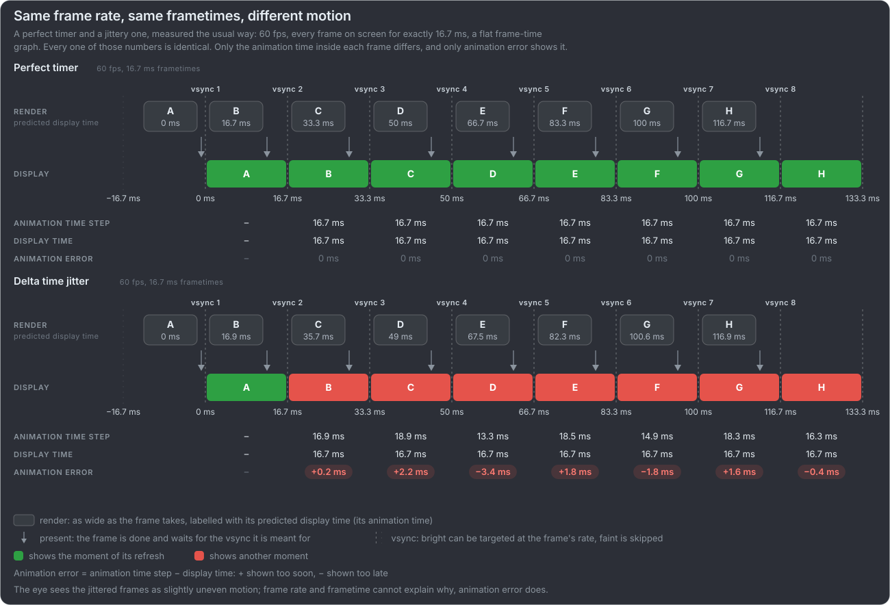
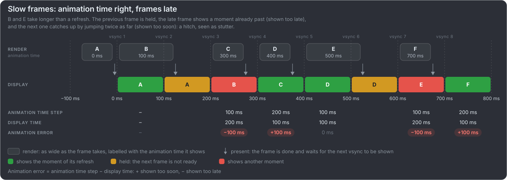

# mb-framepacing-explained

**[▶ Frame pacing, explained: open the page](https://unarmed1000.github.io/mb-framepacing-explained/)**

A game, an interface or any real-time animation can run at a steady 60 fps and still stutter. The page lets you see that for yourself: first two blind tests, where you
compare moving boxes and pick the smoother one before knowing what to look for, then slides that explain what you saw, with the
videos playing live next to timing diagrams. It is a draft; a few parts are unfinished.

What it covers:

- **Stutter** is what you see. It has two causes: **delta time jitter** (frames reach the screen on time but each shows a slightly
  wrong moment) and bad **frame pacing** (frames reach the screen late or unevenly).
- **Animation error** is the one measurement that catches both, and there are several ways to measure it in your own game or app.
- How games and apps fix it: a vsync timer, holding frames for whole refreshes, switching rates with hysteresis, recovering from a spike.

It is the companion of [mb-framepacing](https://github.com/Unarmed1000/mb-framepacing) (pre-alpha), which measures animation error
on a real display output. Both follow the vocabulary of [Intel PresentMon](https://github.com/GameTechDev/PresentMon) and the
[Gamers Nexus animation error methodology](https://gamersnexus.net/gpus-gn-extras-cpus/problem-gpu-benchmarks-reality-vs-numbers-animation-error-methodology-white).

## What is in this repository

The page, and the tools that make its videos and diagrams. The videos are short looping clips where a perfectly timed box moves
next to one timed the way a game's naive wall-clock timer does it (under system load or with a ±N ms jitter), or that replays a
timing diagram's frames exactly, so the difference can be seen rather than described.

| Part                                                   | What it does                                                                                                                             |
| ------------------------------------------------------ | ---------------------------------------------------------------------------------------------------------------------------------------- |
| [`web/`](web)                                          | The page: TypeScript and Vite, published to GitHub Pages by the [pages workflow](.github/workflows/pages.yml) ([notes](doc/web-page.md)) |
| [`tools/frame_pacing_video`](tools/frame_pacing_video) | Generates the comparison videos through FFmpeg, in folders by scene and speed, each with a `manifest.json` of every frame's timing       |
| [`tools/web_export`](tools/web_export)                 | Generates exactly the clips the page's blind test needs, web-encoded                                                                     |
| [`tools/timing_diagrams`](tools/timing_diagrams)       | Generates the timing diagrams and example charts of the docs and the page (`doc/images/*.svg`; `--png` for bitmaps)                      |

Setup needs [uv](https://docs.astral.sh/uv/) (`winget install --id astral-sh.uv` on Windows), then is one command: `setup.cmd`
(Windows) or `./setup.sh` (Linux, macOS), optionally with `--ffmpeg <path>`. uv creates the `.venv` on the Python of
`.python-version` with the packages `uv.lock` pins; the setup then writes the machine-local `local.toml` and fetches the
mb-framepacing submodule (`external/mb-framepacing`, its frame marker library) when the clone did not (`git clone
--recurse-submodules` fetches it right away). Run the tools with `uv run`, e.g. `uv run tools/frame_pacing_video/generate_videos.py --help`.

## Frame pacing in one minute

> [!TIP]
> **Watch it rather than read it:** [the page](https://unarmed1000.github.io/mb-framepacing-explained/) shows all of this with live
> videos and a blind test. What follows is the short version in text.

We say _game_ for anything that animates in real time: games, user interfaces, video playback, VR, simulators.

Every frame a game shows is a picture of one moment of game time, its **animation time**, and it appears on screen at a moment
of real time, its **display time**. Motion looks smooth when the two advance together: a frame that shows 16.7 ms more of the
game than the one before it appears 16.7 ms after it. **Animation error** is how far they disagree, per frame, in milliseconds, as PresentMon measures it. A high average
frame rate says nothing about it.

Each diagram follows the two clocks at a 60 Hz display, a refresh every 16.7 ms, as in the videos. In the **render** row each box is one frame, as
wide as it takes to render and labelled with its **predicted display time**: when the game expects it to be shown, which becomes
its animation time. The game predicts it from the recent frame times (the last one, or several smoothed) and the pacing it aims for, a whole
number of refreshes that fits the refresh period (30 fps on 60 Hz is two). Whether the frame really appears then is the question.
The **arrow** under it is where the game presents it: the frame is done and waits for the next vsync. The **display** row shows
which frame is on screen at each refresh, and the rows below compute the animation error the way PresentMon does. Gamers Nexus
explain the two ways it goes wrong with a flipbook:

| Case                                                                                  | Flipbook                                        | Typical cause                                                                                  |
| ------------------------------------------------------------------------------------- | ----------------------------------------------- | ---------------------------------------------------------------------------------------------- |
| Frames reach the screen evenly, but the **animation time** advances unevenly          | Unevenly drawn pages, flipped at a steady tempo | Delta time jitter: the engine reads its wall clock at an uneven point after each flip          |
| The animation time advances evenly, but frames reach the screen unevenly (**pacing**) | Evenly drawn pages, flipped at an uneven tempo  | A frame over its budget shows a refresh late (a hitch); one submitted too early shows too soon |

**Delta time jitter is invisible to the usual numbers.** Frame rate, frametime, display time step and a frame-time graph are
identical to the perfect timer's: every frame is on screen for exactly one refresh. The eye still sees slightly uneven motion,
and only animation error shows why, because only it looks at the moment each frame shows:

**First things first: fix the animation time before the pacing.** Every diagram after this one assumes a perfect timer (with plain vsync: a vsync timer), frames
rendered for the moment they are meant to appear, so that the errors left come from the display side. How to get there is the first
of the [frame pacing strategies](doc/frame-pacing-strategies.md#first-get-the-animation-time-right).

How frames reach the screen, and how fast input gets there, depends on vsync, VRR and the frame queue: see
[display sync](doc/display-sync.md) and [input latency](doc/input-latency.md).

## Quick vocabulary

The terms used here and in mb-framepacing, in one line each. The [full vocabulary](doc/vocabulary.md) maps them to PresentMon,
Gamers Nexus, Digital Foundry, Unity, Unreal, Android and VR, with sources and the video modes.

| Term                       | In one line                                                                                                       | Also called                                                            |
| -------------------------- | ----------------------------------------------------------------------------------------------------------------- | ---------------------------------------------------------------------- |
| **Animation error**        | Animation time step minus display time step. Positive: shown too soon; negative: late.                            | `MsAnimationError` (PresentMon), simulation time error                 |
| **Animation time**         | The moment of game time a frame shows.                                                                            | Simulation time, game time                                             |
| **Animation time step**    | How far the animation time advanced from one shown frame to the next.                                             | Delta time, `Time.deltaTime`                                           |
| **Predicted display time** | When the game expects a frame to be shown, from recent frame times; the frame's animation time.                   | Expected presentation time (Android), `targetTimestamp` (Apple)        |
| **Display time**           | The moment a frame appeared on screen: a vsync.                                                                   | Present time                                                           |
| **Display time step**      | How far the display time advanced from one shown frame to the next: how long the previous frame stayed on screen. | `MsBetweenDisplayChange`, display delta; "frame time" in overlays      |
| **Frametime**              | CPU start to CPU start: the application side.                                                                     | `MsBetweenPresents`, `MsBetweenAppStart`, CPU frame time               |
| **Frame pacing**           | How evenly frames reach the screen.                                                                               | Frame delivery, cadence; "bad frame-pacing" (Digital Foundry)          |
| **Stutter**                | Motion that suddenly speeds up or slows down: what the eye sees.                                                  | Judder, jerkiness                                                      |
| **Hitch**                  | A single, severe frametime spike.                                                                                 | Spike; shader compilation stutter, traversal stutter (Digital Foundry) |
| **Delta time jitter**      | The measured delta time wobbles while frames reach the screen evenly.                                             | Timestep jitter                                                        |
| **Microstutter**           | Uneven delivery while the average frame rate looks fine.                                                          | Micro stuttering; from multi-GPU, with its runt frames                 |
| **Judder**                 | Uneven display durations for constant motion.                                                                     | Pulldown judder (film), stale frames (VR)                              |
| **Dropped frame**          | Rendered but never shown.                                                                                         | Skipped frame                                                          |
| **Swap interval**          | How many vsyncs a frame stays on screen: 1, 2, 3 for 60, 30, 20 fps at 60 Hz.                                     | Present interval, `SyncInterval`                                       |
| **Tearing**                | Vsync off: one refresh shows parts of two frames.                                                                 | Screen tearing                                                         |
| **VRR**                    | The display refreshes when the frame is ready.                                                                    | G-SYNC, FreeSync, Adaptive-Sync, HDMI VRR                              |
| **Input lag**              | From input to its result on screen.                                                                               | End-to-end latency, click-to-photon, button to pixel (Digital Foundry) |

## What this covers so far

The videos simulate a game loop on a plain vsync display: every frame makes its vsync, and the game only reads its own clock.

| Modes                                                               | What they show                                                                                          | Terms                              |
| ------------------------------------------------------------------- | ------------------------------------------------------------------------------------------------------- | ---------------------------------- |
| `60`, `30`, `20` (ideal timer)                                      | Perfect: each frame shows exactly its display time; 30 and 20 hold each frame 2 or 3 refreshes          | The reference; swap interval       |
| `60-naive-light` / `-typical` / `-heavy` (also `30-`, `-realistic`) | The game's wall clock read a little late or early after the flip, as under system load                  | Delta time jitter, animation error |
| `60-naive-1ms` … `-4ms`, `60-naive-synthetic`                       | A ±N ms window, or a made-up pattern for teaching the metric; alternating errors look like microstutter | Delta time jitter, microstutter    |

Late and held frames are replayed exactly as the timing diagrams show them (`60-diagram-slow-frames`, …). Not simulated yet:
random late frames and long hitches, dropped and runt frames, tearing, VRR and input lag. The
[tool's README](tools/frame_pacing_video/README.md) has the modes, scenes and options; [charts](doc/charts.md) has how to draw the
`manifest.json` data next to the videos.

## Documentation

- [Vocabulary](doc/vocabulary.md): every term, its other names (including Digital Foundry's), where it comes from, and the video
  modes that show it
- [Vsync, VRR and frame rate targets](doc/display-sync.md): vsync and present modes, G-SYNC and FreeSync, what VRR does not fix,
  fixed or adaptive frame rates
- [Advanced frame pacing strategies](doc/frame-pacing-strategies.md): holding a frame for two refreshes, switching between full
  and half rate with hysteresis, and recovering from a frame that overshoots its refresh
- [Input latency](doc/input-latency.md): how it is measured, where it comes from, Reflex, Anti-Lag 2, XeLL and frame generation
- [Measured in real games](doc/measured-errors.md): how large animation error and delta time jitter are in real games and engines,
  with sources, and how the videos' simulated timers compare
- [Charts](doc/charts.md): how Gamers Nexus, PC Perspective, CapFrameX, Digital Foundry and mb-framepacing chart pacing, and what
  to draw here
- [Further reading](doc/further-reading.md): the articles and videos, grouped by subject
- [The web page](doc/web-page.md): the slides and the blind test, running and publishing it, and its 60 Hz and zoom checks
- [Roadmap](doc/roadmap.md): future ideas and next steps, ticked off as they are done

## About the research

Much of the research behind these docs was done with AI assistance: sources were searched for, fetched and checked, and quotes
were compared with the pages they come from, but mistakes are still possible. Check the linked source before relying on a detail,
and please report anything that is wrong. Where the docs go beyond their sources, they say so.

## Contributing

Corrections and new topics are welcome, especially from people who work on engines, drivers, displays or measurement tools,
ideally with a source: open an [issue](https://github.com/Unarmed1000/mb-framepacing-explained/issues) or a pull request. See
[CONTRIBUTING.md](CONTRIBUTING.md) for what helps most, the checks, and the terms for contributions.

## License

(c) 2026 Mana Battery ApS. Everything here (documentation, diagrams, videos and tools) is licensed under
[CC BY-NC-SA 4.0](https://creativecommons.org/licenses/by-nc-sa/4.0/) ([full text](LICENSE)): you may share and adapt it for
non-commercial purposes, with credit; adapted versions must say what was changed and be shared under the same license.
Commercial use needs written permission from Mana Battery ApS.
It is provided as is, without warranty or liability. Quotations from third-party articles and videos remain their owners'.
The exceptions are AMD's FSR 1 headers in [`tools/frame_pacing_video/fsr1`](tools/frame_pacing_video/fsr1), under their own MIT
licence ([text](tools/frame_pacing_video/fsr1/LICENSE.txt)). The frame marker library comes from mb-framepacing itself, the
submodule [`external/mb-framepacing`](https://github.com/Unarmed1000/mb-framepacing) (its `sdk/python`, under the BSD 3-Clause
licence; its QR encoder under the MIT licence), and is not part of this repository.
