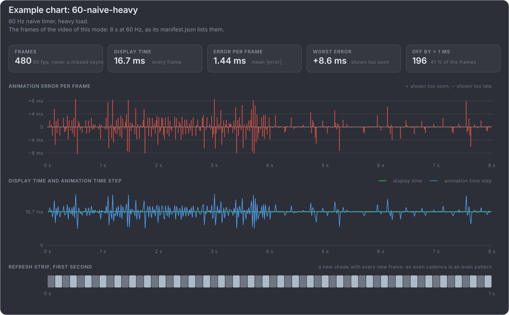
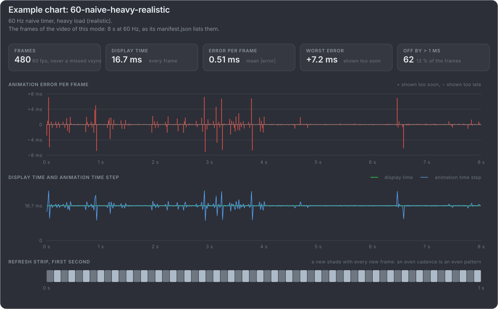
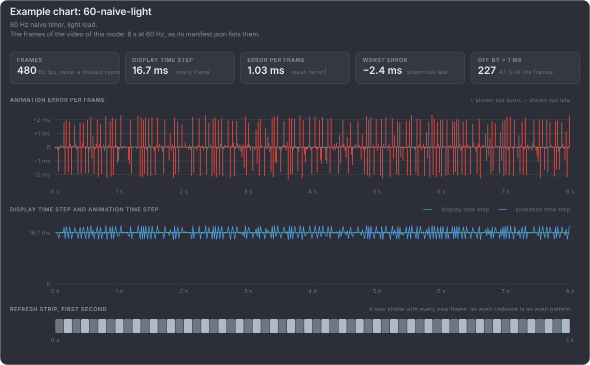

# Showing frame pacing in charts

A video shows what animation error looks like; a chart next to it shows which frames caused it. This page collects how the
established tools and reviewers chart frame pacing, compares that with [mb-framepacing](https://github.com/Unarmed1000/mb-framepacing)
recommends a set for the web page with generated examples, and lists ideas for mb-framepacing. Sources are in
[further reading](further-reading.md#charts-and-tools).

## How others chart it

| Source                                                                                                                                  | Charts                                                                                                                                                                                                                                                                                                                                                                                                                                                                                                                                                                                   |
| --------------------------------------------------------------------------------------------------------------------------------------- | ---------------------------------------------------------------------------------------------------------------------------------------------------------------------------------------------------------------------------------------------------------------------------------------------------------------------------------------------------------------------------------------------------------------------------------------------------------------------------------------------------------------------------------------------------------------------------------------- |
| [Gamers Nexus](https://gamersnexus.net/gpus-gn-extras-cpus/problem-gpu-benchmarks-reality-vs-numbers-animation-error-methodology-white) | **Animation error as a signed scatter in frame order**: "The left axis shows animation error in ms, with deviations away from zero depending on whether frames showed up too soon or too late"; "The X-axis represents frames". Next to it a frametime plot and frame rate bars (average, 1 % and 0.1 % lows). Summaries: **error per frame** (sum of absolute errors / frames) and **percent error** (sum of absolute errors / run length), in absolute values, because "adding together all the positive and negative animation errors for a logging period will typically cancel out" |
| [PC Perspective / FCAT](https://pcper.com/2013/03/frame-rating-dissected-full-details-on-capture-based-graphics-performance-testing/4/) | Frame times per frame ("a 'wider' line or one with a lot of peaks and valleys indicates a lot more variance"), **observed FPS** (runts and drops removed), minimum FPS by percentile, and frame variance against the running average of the previous 20 frames. The [FCAT overlay](https://pcper.com/2013/03/frame-rating-dissected-full-details-on-capture-based-graphics-performance-testing/2/) draws a colour bar per frame into the image, so the captured video shows how long each frame was on screen                                                                            |
| [CapFrameX](https://github.com/CXWorld/CapFrameX)                                                                                       | Frametime graphs, FPS graphs and **L-shapes** (frame times sorted by percentile); a stutter share (frametimes above 2.5 × the average); the difference between consecutive frame times                                                                                                                                                                                                                                                                                                                                                                                                   |
| [Blur Busters TestUFO](https://testufo.com/stutter)                                                                                     | The same moving object switched between perfect motion, minor stutters and vsync frame rate halvings; an [animation time graph](https://testufo.com/animation-time-graph) whose frame-skip indicator flickers magenta and cyan unevenly when frames repeat or skip                                                                                                                                                                                                                                                                                                                       |
| [PresentMon](https://game.intel.com/us/intel-presentmon/)                                                                               | An overlay of "real-time performance charting that supports multi-line graphs and histograms", with percentiles and averages, for any metric, including `MsAnimationError`                                                                                                                                                                                                                                                                                                                                                                                                               |
| Digital Foundry                                                                                                                         | Frame rate and frame time graphs laid over the gameplay video, computed by comparing the captured output frame by frame rather than from the game's timing (as described by the RTSS developer on [Guru3D](https://forums.guru3d.com/threads/which-frametime-calculation-point-do-digital-foundry-use-in-their-works.453755/)); see [How We Measure Console Frame-Rate](https://www.youtube.com/watch?v=KVg19CbkXR4)                                                                                                                                                                     |

Intel's [animation error experiment app](https://github.com/GameTechDev/PresentMon/issues/580) is the closest to this repository:
a 2D shape panning across the screen to "observe effect on animation error metric vs. perceived 'smoothness' of animation".

## mb-framepacing

The Analyze page of mb-framepacing charts measured captures: animation error per frame over time, with a band of ±1 capture
period (the measurement resolution); the error distribution; the error by percentile (p95, p99, the same idea as an L-shape);
the display time distribution; display against animation time; and the drift. Headline tiles give the typical (p95) and worst
error and the number of frames visibly off. See its [README](https://github.com/Unarmed1000/mb-framepacing#reading-the-results).

The clips here are exact, so their charts need no resolution band, and they are short (8 s) and made to be read frame by frame
next to the video, rather than summarised.

## Recommended for the web page

Every chart comes from the clip's `manifest.json`, which has four arrays per mode under `frames`:

| Chart                                                                         | Data                                                                   | Shows                                                                                          | After                                      |
| ----------------------------------------------------------------------------- | ---------------------------------------------------------------------- | ---------------------------------------------------------------------------------------------- | ------------------------------------------ |
| **Animation error** per frame, signed bars around zero                        | `animationErrorMs`                                                     | Which frames are off, and which way                                                            | Gamers Nexus                               |
| **Display time and animation time step** per frame, two lines on one ms scale | display time: `refresh` differences × the refresh period; step: `dtMs` | The two ways animation error happens: even display with an uneven step, or the other way round | mb-framepacing's display against animation |
| **Refresh strip**: one cell per refresh, alternating colours per frame        | `refresh`                                                              | The cadence at a glance: 1-1-1, 2-2-2, or an uneven mix                                        | FCAT overlay, TestUFO                      |
| **Summary**: mean absolute error per frame                                    | `animationErrorMs`                                                     | One number to compare the top and bottom box                                                   | Gamers Nexus error per frame               |

A playhead that follows the looping video ties them together: the frame on screen is the bar under the playhead. Put the grid lines
of the display time chart at whole refreshes (16.7, 33.3, 50 ms at 60 Hz), because that is the grid a plain vsync display shows
frames on.

## Examples

Generated by [`tools/timing_diagrams/generate_charts.py`](../tools/timing_diagrams/generate_charts.py) from the videos' own frame
simulation, so each shows exactly the frames of that mode's 8 s clip at 60 Hz. The four recommended charts share one card: the
summary tiles, the animation error bars, the two clocks as lines, and the refresh strip of the first second. Every scale is shared
within a chart, and the display side is always drawn next to the animation side, the two things a first hand-made chart lacked.

The naive timer under heavy load, as a demo (an error in most frames): the display is perfect, 16.7 ms on every frame and an even
refresh strip, while the animation time step jumps around it.

The same load with its realistic rates: rare spikes, but the same kind of error.

Light load: smaller errors, all around 1–2 ms.

Any mode can be charted: `python tools/timing_diagrams/generate_charts.py 30-naive-typical 60-naive-4ms` (`--png` for bitmaps).

## Ideas for mb-framepacing

mb-framepacing already has most of these charts for measured captures, and the mean, p95 and worst error. What it could add:

- **Synced playback.** It records the video, so a click on a spike in a chart could open that captured frame, and a playhead
  could follow the recording. No other tool can do this, because none of them keeps the capture.
- **Gamers Nexus's summaries by their names.** Its mean absolute animation error is Gamers Nexus's **error per frame**; showing
  it under that name, next to **percent error** (sum of absolute errors / run length), makes its numbers comparable with Gamers
  Nexus's reviews.
- **A refresh strip**, in the spirit of the FCAT overlay: which frame is on screen at each captured refresh, so repeated, skipped
  and torn frames stand out at a glance.
- **A stutter share**, as in CapFrameX: the share of frames whose display time is over 2.5 × the median.
- **SVG export** of its charts (ScottPlot can save SVG), so reports and these docs can use the same charts, sharp at any size.
