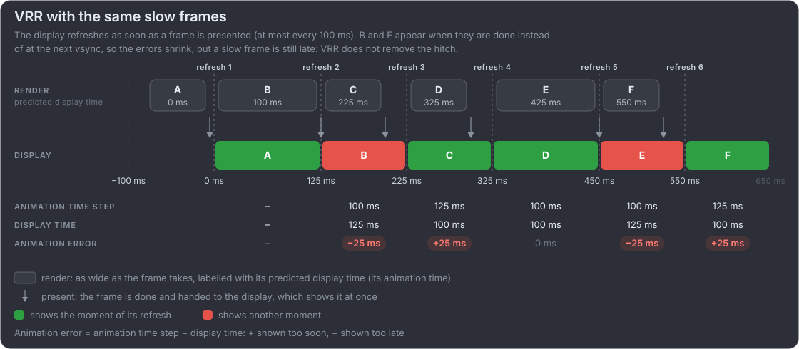
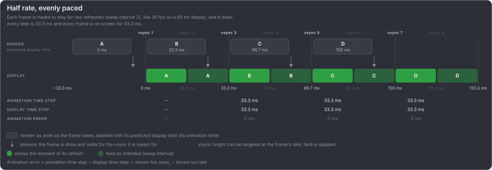

# Vsync, VRR and frame rate targets

How a frame gets from the game to the screen decides its [display time](vocabulary.md). This page covers the parts that matter for
frame pacing, briefly; the links go deeper. The videos in this repository simulate plain vsync on a fixed refresh display.

## Vsync

With vsync on, a finished frame waits for the display's next refresh (vblank), so the screen never shows two frames at once. It has
two costs ([NVIDIA](https://www.nvidia.com/en-us/geforce/news/introducing-nvidia-g-sync-revolutionary-ultra-smooth-stutter-free-gaming/)):

- **Stutter below the refresh rate.** A frame that misses its refresh leaves the previous one on screen for another refresh. With
  double buffering at 60 Hz the game falls to 30 fps (33.3 ms); with a queue of frames the display times alternate between 16.7
  and 33.3 ms.
- **Latency.** When the game runs faster than the display, finished frames wait in a queue. NVIDIA calls it the "back pressure"
  from the display; see [input latency](input-latency.md).

With vsync off, a frame replaces the old one mid-scan, and one refresh shows parts of two frames: **tearing**. It is the lowest
latency, if the tear line can be tolerated.

### In the graphics APIs

Vulkan names the choices as [present modes](https://docs.vulkan.org/refpages/latest/refpages/source/VkPresentModeKHR.html):

| Present mode | Behaviour                                                                                             | Usual name                                                   |
| ------------ | ----------------------------------------------------------------------------------------------------- | ------------------------------------------------------------ |
| `FIFO`       | A queue, one frame per vblank; never tears. The only mode every implementation must support           | Vsync on                                                     |
| `IMMEDIATE`  | Shows a frame straight away; may tear                                                                 | Vsync off                                                    |
| `MAILBOX`    | A one-entry queue: a newer frame replaces the waiting one, and the newest is shown at the next vblank | Similar to NVIDIA Fast Sync / AMD Enhanced Sync (an analogy) |

On Windows the [DXGI flip model](https://learn.microsoft.com/en-us/windows/win32/direct3ddxgi/for-best-performance--use-dxgi-flip-model)
plays the same role: a waitable swap chain keeps the queue short, and `DXGI_SWAP_CHAIN_FLAG_ALLOW_TEARING` with sync interval 0 is
vsync off. The **swap interval** (`SyncInterval`, `eglSwapInterval`) holds each frame for 1, 2 or 3 vblanks: 60, 30 or 20 fps on a
60 Hz display.

## Variable refresh rate (VRR)

VRR turns vsync around: the display refreshes when the GPU delivers a frame, instead of the GPU waiting for the display. NVIDIA
calls it [G-SYNC](https://www.nvidia.com/en-us/geforce/news/introducing-nvidia-g-sync-revolutionary-ultra-smooth-stutter-free-gaming/);
AMD's [FreeSync](https://www.amd.com/en/products/graphics/technologies/freesync.html) builds on the industry standards, VESA
DisplayPort Adaptive-Sync and HDMI VRR. Inside the display's range there is no tearing, and none of vsync's rounding to whole
refreshes.

- **The range.** A display supports VRR between a minimum and a maximum refresh rate, for example 48–144 Hz.
- **Below the range**, low framerate compensation (LFC) shows each frame two or more times: AMD's example is a 60–144 Hz display
  running a 40 fps game at 80 Hz.
- **Above the range** vsync or tearing takes over again. The usual setup is vsync on plus a frame rate cap a few fps under the
  maximum; with G-SYNC, NVIDIA Reflex and Ultra Low Latency Mode apply that cap automatically
  ([NVIDIA](https://www.nvidia.com/en-us/geforce/guides/gfecnt/202010/system-latency-optimization-guide/),
  [Blur Busters](https://blurbusters.com/gsync/gsync101-input-lag-tests-and-settings/)).

### What VRR does not fix

VRR changes _when_ a frame appears, not _which animation time_ the game rendered it for. It follows from how it works, rather than
from a measurement we can cite:

- **Delta time jitter stays.** If the game's clock reading is off, the frame shows the wrong moment however well it is paced; the
  naive timer modes in the videos would look the same on a VRR display. Frame rate and frametime tools do not see it either (see
  [the comparison](vocabulary.md#the-two-ways-animation-error-happens)).
- **Hitches stay.** A frame that takes 80 ms to render is still an 80 ms frame; VRR only shows it as soon as it is ready.
- **Uneven frame times become uneven display times.** Without vsync's fixed grid, every change in frametime reaches the screen, so
  animation error then depends on how well the game's animation time step matches its own frame times.

The [slow frames](../README.md#frame-pacing-in-one-minute) of the vsync diagram, on a VRR display: B and E appear as soon as they
are done, so their error shrinks from 100 to 25 ms, but they are still late, and the next frame still jumps ahead.

Digital Foundry found that the PS5's VRR has
[stuttering problems of its own](https://www.youtube.com/watch?v=z2smFwG3Xkc) (2025), after
[testing the first VRR update](https://www.youtube.com/watch?v=3v2aks-su2s) (2022).

## Fixed or adaptive frame rate

- **A fixed target** that divides the refresh rate gives even pacing on a plain display: 60 or 30 fps on 60 Hz, and 40 fps on
  120 Hz. Digital Foundry on
  [Ratchet & Clank's 40 fps mode](https://www.youtube.com/watch?v=QXi7uO7wxdc): "Instead of updating every 33.3ms (30fps) on a 60Hz
  screen, Ratchet updates every 25ms (40fps) at 120Hz, the same consistency but smoother." A cap only helps if it is implemented
  right: Digital Foundry keep finding [30 fps caps with bad frame pacing](https://www.youtube.com/watch?v=tvzdJh3bvAs), where frames
  are not held for an even two refreshes each; in
  [Bloodborne](https://www.digitalfoundry.net/articles/digitalfoundry-2015-bloodborne-performance-analysis) they swung "between
  16ms and 66ms".
- **An unlocked frame rate** on a fixed refresh display mixes display times of one and two refreshes (or tears with vsync off), so
  it is uneven even when the average looks high.
- **An unlocked frame rate on VRR** is smooth as long as the frametime is stable and the game's delta time follows it.
- **Dynamic resolution** is the other lever: games lower the render resolution under load to hold a fixed target.

Half rate on a 10 Hz display (a slowed-down 30 fps on 60 Hz), first evenly paced, then with the bad pacing of a broken cap: the
animation steps 200 ms per frame in both, but only the first shows each frame for 200 ms.

## In the videos

| Case                                | Modes                                                                              |
| ----------------------------------- | ---------------------------------------------------------------------------------- |
| A locked 60, 30 or 20 fps on 60 Hz  | The ideal timer: `60`, `30`, `20` (swap interval 1, 2, 3)                          |
| Plain vsync, the game's clock off   | The naive timer: `60-naive-light` … `-heavy` (also at 30), `60-naive-1ms` … `-4ms` |
| Missed refreshes, tearing, VRR, LFC | Not simulated yet: every frame makes its vsync                                     |
