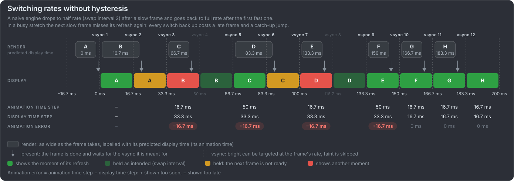
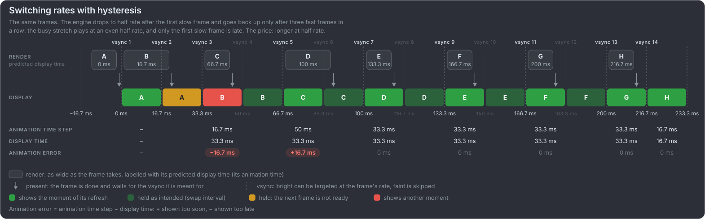
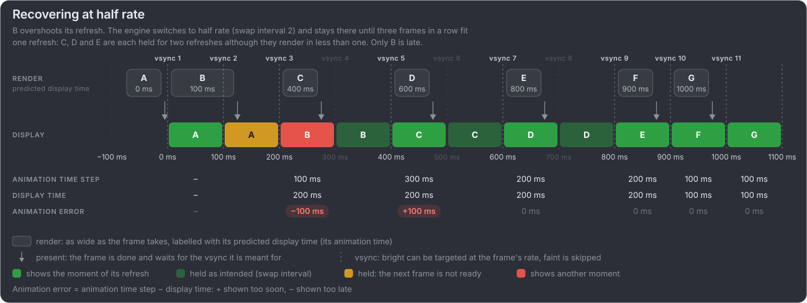
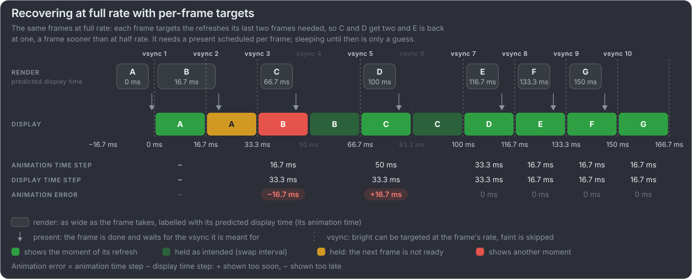

# Advanced frame pacing strategies

For engine developers, in the order to tackle them: getting the animation time right with a vsync timer, holding a frame for more
than one refresh, switching between full and half rate, and recovering after a frame overshoots its refresh. Everything assumes
vsync on and a fixed refresh rate; VRR and vsync off are [still open](#still-open-vrr-and-vsync-off). The diagrams follow the conventions of the
[overview](../README.md#frame-pacing-in-one-minute): a 10 Hz display (a refresh every 100 ms, easy to see and to count), bright vsyncs a frame can target at
its rate and faint ones it skips.

**The baseline has to work on the simplest platform**: plain vsync, no extensions, at worst a hard-coded refresh rate. The vsync
timer, a swap interval where the API has one, and switching rates with hysteresis all fit that. Presentation feedback, scheduled
presents and per-frame targets are improvements for platforms that offer them, never requirements.

## First: get the animation time right

Every diagram on this page assumes the animation time is already right: each frame is rendered for its predicted display time, the
moment it is meant to appear, so a frame that does appear then has no animation error. That comes first. A game that renders its
frames for the wrong moment has animation error on every frame however well it paces them: the delta time jitter of the
[overview](../README.md#frame-pacing-in-one-minute), which frame rate and frametime cannot even see.

### The vsync timer

On a fixed-refresh display with vsync on, every frame appears a whole number of refreshes after the previous one. So the animation
time only has to advance in whole refreshes, and that works with plain vsync, without any modern API or extension:

1. **Know the refresh period**: a hard-coded value is enough to start, then the display mode where the platform reports it, or the
   average time between the loop's own frames over many frames, which needs nothing but the wall clock (59.94 Hz is not 60 Hz).
2. **Measure the time since the previous frame** with the wall clock, as the naive timer does, **and round it to whole
   refreshes**: the number of refreshes is the measured time divided by the refresh period, rounded, and at least the swap
   interval.
3. **Render the frame for its predicted display time**: the previous frame's display time plus the swap interval.

Rounding removes the wake-up jitter of the naive timer, as long as that stays under half a refresh: 8.3 ms at 60 Hz, but only
2.1 ms at 240 Hz. A missed vsync still costs one late frame, since the game cannot know in advance, but it shows up as a whole extra
refresh in the next measurement, so the frame after it catches up exactly. This is the timer behind every diagram here (the "perfect
timer") and the ideal timer of the videos. Tyler Glaiel describes the same idea as snapping the delta time to 1/60 s when a frame
took about 1/60 s, and to its multiples likewise
([How to make your game run at 60fps](https://medium.com/@tglaiel/how-to-make-your-game-run-at-60fps-24c61210fe75)).

What it relies on:

- **vsync on and a fixed refresh rate.** With VRR or vsync off there is no grid to round to ([still open](#still-open-vrr-and-vsync-off)).
- **A loop paced by vsync**: it waits in `Present` (or for a free buffer) every frame, so its wake-ups follow the refreshes.
- **An accurate refresh period**: a slightly wrong period adds up over time ([drift](#appendix-b-drift)).

Two things to think through before building one, each in an appendix: where the vsync signal comes from on each platform and how
exact it is ([appendix A](#appendix-a-vsync-signals-per-platform)), and how the timer's clock drifts away from the CPU's, the
audio's and the network's ([appendix B](#appendix-b-drift)).

### With presentation feedback

Where the platform reports when frames really appeared, or when the next one will, the game does not have to infer it from its own
wake-ups:

- Android's [Choreographer](https://developer.android.com/ndk/reference/group/choreographer) gives each frame an expected
  presentation time: "This time should be used to advance any animation clocks."
- OpenXR's [`predictedDisplayTime`](https://registry.khronos.org/OpenXR/specs/1.0/man/html/XrFrameState.html) is "the anticipated
  display XrTime for the next application-generated frame".
- `VK_GOOGLE_display_timing` and `VK_EXT_present_timing` report past presentation times, Metal gives each drawable its
  `presentedTime`, and Wayland's stable [presentation-time](https://wayland.app/protocols/presentation-time) protocol reports that a
  frame "was displayed to the user at the indicated time". Its `refresh` is "the compositor's prediction of how many nanoseconds
  after tv_sec, tv_nsec the very next output refresh may occur", zero when no prediction can be made or the output has no constant
  refresh rate, and its `vsync` flag says the presentation "was synchronized to the 'vertical retrace'".
- Windows has it too: [`IDXGISwapChain::GetFrameStatistics`](https://learn.microsoft.com/en-us/windows/win32/api/dxgi/ns-dxgi-dxgi_frame_statistics)
  (flip model or full screen) gives the present and refresh counts to "determine whether a glitch occurred", and `SyncQPCTime`
  for "audio and video synchronization or very precise animation".
- Unity 2020.2 [fixed the jitter of `Time.deltaTime`](https://unity.com/blog/engine-platform/fixing-time-deltatime-in-unity-2020-2-for-smoother-gameplay)
  by basing it on the display's timing instead of the CPU's.

Without either, a game can only smooth its measured frame times
([time delta smoothing](https://frankforce.com/frame-rate-delta-buffering/)): that averages the jitter out, but follows real
changes more slowly.

## Holding a frame for more than one refresh

At half rate (30 fps on 60 Hz) every frame should stay on screen for two refreshes. A frame that renders in less than one refresh
is ready early, and if nothing holds it back, it appears after one refresh and the one after it stays for three: the bad 30 fps
frame pacing of the [display sync page](display-sync.md#fixed-or-adaptive-frame-rate). The
[Android Frame Pacing library](https://developer.android.com/games/sdk/frame-pacing) describes the result: "the game render loop
doesn't realize that a repeated frame remains on the screen for an extra 16 milliseconds. This disconnect usually creates
substantial inconsistency in frame times, such as: 49 milliseconds, 16 milliseconds, 33 milliseconds."

There are three ways to hold a frame back:

| Method                  | APIs                                                                                                                                                                                                                                                                                                                                                                                                                                                                                                                                                                                                                                                                                                                                                                                                                                                                                                                                                                                                | Notes                                                                                                                                                                                                                                                                                                                                              |
| ----------------------- | --------------------------------------------------------------------------------------------------------------------------------------------------------------------------------------------------------------------------------------------------------------------------------------------------------------------------------------------------------------------------------------------------------------------------------------------------------------------------------------------------------------------------------------------------------------------------------------------------------------------------------------------------------------------------------------------------------------------------------------------------------------------------------------------------------------------------------------------------------------------------------------------------------------------------------------------------------------------------------------------------- | -------------------------------------------------------------------------------------------------------------------------------------------------------------------------------------------------------------------------------------------------------------------------------------------------------------------------------------------------- |
| **Swap interval**       | DXGI [`Present(SyncInterval)`](https://learn.microsoft.com/en-us/windows/win32/api/dxgi/nf-dxgi-idxgiswapchain-present) ("for at least _n_ vertical blanks" in the flip model), [`eglSwapInterval`](https://registry.khronos.org/EGL/sdk/docs/man/html/eglSwapInterval.xhtml) ("the minimum number of video frames that are displayed before a buffer swap"), Unity [`QualitySettings.vSyncCount`](https://docs.unity3d.com/ScriptReference/QualitySettings-vSyncCount.html)                                                                                                                                                                                                                                                                                                                                                                                                                                                                                                                        | Whole refreshes only, counted from the previous flip. DXGI takes it with every `Present`, so it can change per frame. Core Vulkan has none: FIFO "is equivalent to … a swap interval of 1". Wayland's [fifo](https://wayland.app/protocols/fifo-v1) protocol (`wp_fifo_v1`, staging) is its FIFO: an update stays "for at least one refresh cycle" |
| **Scheduled present**   | Vulkan [`VK_EXT_present_timing`](https://docs.vulkan.org/refpages/latest/refpages/source/VkPresentTimingInfoEXT.html) (`targetTime`, absolute or relative to the previous frame's first visible pixel), [`VK_GOOGLE_display_timing`](https://docs.vulkan.org/refpages/latest/refpages/source/VkPresentTimeGOOGLE.html) (`desiredPresentTime`), Android [`eglPresentationTimeANDROID`](https://registry.khronos.org/EGL/extensions/ANDROID/EGL_ANDROID_presentation_time.txt), Metal [`present(afterMinimumDuration:)`](<https://developer.apple.com/documentation/metal/mtldrawable/present(afterminimumduration:)>) and `present(at:)`, Windows [Composition Swapchain `SetTargetTime`](https://learn.microsoft.com/en-us/windows/win32/api/presentation/nf-presentation-ipresentationmanager-settargettime), Wayland [commit-timing](https://wayland.app/protocols/commit-timing-v1) (`wp_commit_timer_v1.set_timestamp`: "as closely as possible to, but not before, a specified time"; staging) | The frame says when it should appear. Swappy uses the Android ones "so that frames are not presented early"; Metal's is meant "to schedule drawables at a regular interval"                                                                                                                                                                        |
| **Sleep, then present** | Any                                                                                                                                                                                                                                                                                                                                                                                                                                                                                                                                                                                                                                                                                                                                                                                                                                                                                                                                                                                                 | A software limiter: the thread wakes up a little late, differently every time (what the naive timer videos show), and at 240 Hz a refresh is only 4.2 ms. Unity: `targetFrameRate` "is subject to microstuttering"                                                                                                                                 |

Where the only thing available is FIFO with no swap interval above one (core Vulkan, core Wayland), there is still a baseline way
that needs no timing guess (our suggestion, following from how FIFO works): **present each frame twice**, by copying the finished
frame into the next swapchain image and presenting that as well. FIFO shows one present per refresh, so the frame stays for two,
at the cost of a copy and a present.

Digital Foundry asks PC games to let players choose the swap interval: "Include 1/2, 1/3 and 1/4 v-sync options", one of Alex
Battaglia's [13 ways to end lousy PC ports](https://www.youtube.com/watch?v=Kr7RGkFuPdQ&t=583s) (2023).

Engines wrap these for you. Unreal has a frame pacer: `SetFramePace` "sets the pace we would like to running at (30 = 30fps,
0 = unpaced)", and its generic version sets `rhi.SyncInterval` from the display's refresh rate
([API](https://dev.epicgames.com/documentation/en-us/unreal-engine/API/Runtime/ApplicationCore/FGenericPlatformRHIFramePacer/SetFramePace)).
On mobile the pace is set per device in the device profiles (`r.SetFramePace`), and on Android Unreal "integrates the Swappy frame
pacing library from the Android Game SDK", "enabled by default in UE 5.2 and newer"
([mobile frame pacing](https://dev.epicgames.com/documentation/en-us/unreal-engine/frame-pacing-for-mobile-devices-in-unreal-engine)).
Unity sets the swap interval with `vSyncCount` and has an Android option, **Optimized Frame Pacing**, to "evenly distribute frames
for less variance in frame rate" ([Android player settings](https://docs.unity3d.com/Manual/class-PlayerSettingsAndroid.html)).
Whether an engine also switches rates on its own differs: Epic's mobile docs describe a pace set per device, while Swappy itself
switches automatically by default ([below](#switching-between-full-and-half-rate)).

Unity's advice sums it up: "Always use vSyncCount > 0 when smooth frame pacing is needed"
([`Application.targetFrameRate`](https://docs.unity3d.com/ScriptReference/Application-targetFrameRate.html)). Holding frames longer
costs latency too: Epic notes that "in a 30 Hz title with rhi.SyncInterval set to 2, this can lead to a worst case input latency of
up to 130 ms" ([low-latency frame syncing](https://dev.epicgames.com/documentation/en-us/unreal-engine/low-latency-frame-syncing-in-unreal-engine)).
Whether that matters depends on the input: a remote-controlled interface can trade latency for smoothness, a mouse-aimed game
cannot ([how much latency matters](input-latency.md#how-much-it-matters)).

## Switching between full and half rate

A game that cannot hold full rate everywhere can drop to half rate when frames stop fitting a refresh, and go back up when they fit
again: graceful degradation. The hard part is when to go back up.

A naive engine goes back to full rate after the first frame that fits. In a busy stretch, where slow and fast frames alternate, the
next slow frame then misses its refresh at full rate, and every switch back up costs a late frame and a catch-up jump:

With hysteresis the engine goes back up only after several fast frames in a row (three here). The busy stretch plays at an even
half rate, and only the first slow frame is late. The price is more time at half rate:

Android's Frame Pacing library (Swappy) does this for games that "deliver 30 Hz in some scenes and 60 Hz in others", with its auto
swap interval, on by default. Its docs do not describe the rule; its
[source](https://android.googlesource.com/platform/frameworks/opt/gamesdk/+/refs/heads/main/games-frame-pacing/common/SwappyCommon.cpp)
does:

- it decides over 2 s of frame times, never frame by frame;
- it drops to a longer swap interval when more than 10 % of the frames missed their refresh;
- it goes back up only when none did, and the frames fit the shorter interval with 1 ms to spare;
- after every change it starts a new 2 s window.

## Recovering from an overshoot

One frame (a shader compile, a streaming spike) takes longer than a refresh, and every frame after it fits again. How soon can the
game be back at full rate without another late frame?

Switching to half rate, and back after three fast frames, holds C, D and E for two refreshes each, although each renders in less
than one:

Staying at full rate and giving each frame its own target (here the refreshes the slowest of its last two frames needed) brings the
game back a frame sooner, with the same single late frame:

Per-frame targets need a way to schedule each present: a swap interval that can change with every present (DXGI), or a scheduled
present (the table above). Without one, the game has to sleep until the refresh it wants and present then, which is a guess, and
at high refresh rates a guess that often misses. Both recoveries have their place: the half-rate grid is the
baseline, simple and predictable; per-frame targets recover sooner, where the API can schedule them.

## Still open: VRR and vsync off

With VRR or vsync off there is no refresh grid: a frame appears when it is done, so the vsync timer has nothing to round to, and the
animation time has to predict when the frame will be finished and shown. What works best there is still an open question; this
section will come later. What VRR does and does not fix is on the [display sync](display-sync.md#variable-refresh-rate-vrr) page.

## Appendix A: Vsync signals per platform

The vsync timer needs a signal that follows the refreshes, to pace on and to measure, and the refresh period, to round with. Every
platform has one, without extensions, but they differ in what their time stamp means and in how exact it is.

- **Wayland (core protocol).** Two things are available without extensions:
  - The refresh rate: [`wl_output.mode`](https://gitlab.freedesktop.org/wayland/wayland/-/blob/main/protocol/wayland.xml) gives the
    "vertical refresh rate in mHz". The protocol says "clients should not use the refresh rate to schedule frames", meaning: do not
    decide _when_ to draw from it. The vsync timer uses it for something else, to round its measured intervals to whole refreshes.
    It makes a good guideline, the starting value that measurement then refines, but not the truth: it is the mode's nominal rate;
    it "can be set to zero if it doesn't make sense for this output (e.g. for virtual outputs)" and some compositors "might fake
    the refresh rate"; and a surface can be on several outputs, each with its own rate. So fall back to measuring (or a
    hard-coded value) when it is zero, trust the measurement when the two disagree, and where presentation-time is available, its
    `sync_output` event says which output a frame was "synchronized to".
  - A frame event: `wl_surface.frame` asks for "a notification when it is a good time to start drawing a new frame", "useful for
    throttling redrawing operations, and driving animations", with a time "in milliseconds, with an undefined base".

  The frame event is not reliable everywhere. The protocol only says what a compositor _should_ do: when to send it is up to the
  compositor, and it "should avoid signaling the frame callbacks if the surface is not visible", so events can come late, bunched
  or not at all. Treat it as a hint: check each interval against the expected refresh period and ignore the outliers, and where it
  misbehaves, pace on the graphics API's blocking present instead (on Wayland that may wait for the same event underneath, so
  test on the compositors that matter).

- **Windows (DXGI and DWM).** The display mode's refresh rate is a
  [`DXGI_RATIONAL`](https://learn.microsoft.com/en-us/windows/win32/api/dxgicommon/ns-dxgicommon-dxgi_rational), so 59.94 Hz is
  exact, and [`DwmGetCompositionTimingInfo`](https://learn.microsoft.com/en-us/windows/win32/api/dwmapi/ns-dwmapi-dwm_timing_info)
  gives the monitor's `qpcRefreshPeriod` and `qpcVBlank`, "the query performance counter value before the vertical blank". The loop
  paces on `Present` with a sync interval, and
  [`IDXGIOutput::WaitForVBlank`](https://learn.microsoft.com/en-us/windows/win32/api/dxgi/nf-dxgi-idxgioutput-waitforvblank) can
  "halt a thread until the next vertical blank occurs"; it belongs to one output, so it has to be the monitor the window is on.
  Since Windows 8.1 the [waitable swap chain](https://learn.microsoft.com/en-us/windows/win32/api/dxgi1_3/nf-dxgi1_3-idxgiswapchain2-getframelatencywaitableobject)
  "signals when the DXGI adapter has finished presenting a new frame", and "for every frame it renders, the app should wait on
  this handle before starting any rendering operations": a pacing signal that also keeps the frame queue short.
- **X11 (GLX).** [`GLX_OML_sync_control`](https://registry.khronos.org/OpenGL/extensions/OML/GLX_OML_sync_control.txt) counts
  refreshes: the media stream counter (MSC) "increments for each vertical retrace", and "a UST timestamp is obtained each time the
  graphics MSC is incremented", adjusted to when "the first scan line of the display begins passing through the video output
  port". A real vblank count with a time stamp. Without GLX, the X [Present extension](https://gitlab.freedesktop.org/xorg/proto/xorgproto/-/blob/master/presentproto.txt)
  does the same: its completion event's "'msc' and 'ust' indicate the frame count and system time when the presentation actually
  occurred", and `PresentPixmap` can target a refresh count (`target-msc`, with a `divisor` and `remainder`), a scheduled present
  on plain X11.
- **Android.** [Choreographer](https://developer.android.com/ndk/reference/group/choreographer) calls back "when the application
  should begin rendering the next frame", with a frame time in `CLOCK_MONOTONIC` nanoseconds. Newer versions say that this time
  "should **not** be used to advance animation clocks" and point to the expected presentation time instead: the predicted
  display time, ready made.
- **Apple.** [`CADisplayLink`](https://developer.apple.com/documentation/quartzcore/cadisplaylink/targettimestamp) calls back every
  refresh, and its `targetTimestamp` is "when the next frame displays".
- **Web.** [`requestAnimationFrame`](https://developer.mozilla.org/en-US/docs/Web/API/Window/requestAnimationFrame) calls back at a
  rate that "will generally match the display refresh rate", with a time stamp of "the end time of the previous frame's
  rendering" at "a minimal precision of 1 millisecond"; calls are "paused in most browsers when running in background tabs". For
  video, [`requestVideoFrameCallback`](https://developer.mozilla.org/en-US/docs/Web/API/HTMLVideoElement/requestVideoFrameCallback)
  (Baseline since October 2024) gives each frame's `expectedDisplayTime`, "when the browser expects the frame to be visible", and
  `presentedFrames`, which "can be used to detect whether frames were missed": what the [web page](web-page.md) needs for its
  60 Hz check.

Common catches: a callback's time is when the system decided to wake the game, not necessarily the vblank, so use it to pace and to
round, not as an exact display time; callbacks stop while the window is hidden or in the background, so the timer needs a rule for
the first frame after a pause; a millisecond time stamp is too coarse to measure one frame, but fine to round to whole
refreshes; and the refresh rate can change while the game runs, when the window moves to another monitor, the mode changes or a
laptop lowers its rate. Wayland reports a move with
[`wl_surface.enter`](https://gitlab.freedesktop.org/wayland/wayland/-/blob/main/protocol/wayland.xml) ("emitted whenever a
surface's creation, movement, or resizing results in some part of it being within the scanout region of an output"), while
Windows' `WM_DISPLAYCHANGE` is documented for resolution changes only, so the timer should keep measuring the period rather than
rely on a notification.

## Appendix B: Drift

A vsync timer counts refreshes, so its clock runs at the display's pace, not the CPU's. The two drift apart:

- Assuming 60 Hz on a 59.94 Hz display is off by 0.1 %: about 3.6 s per hour. Even an exact mode rate is not the display's real
  period, which the display's own clock sets, independent of the CPU's.
- **The picture does not suffer.** Each step still matches what the display shows, so the animation error stays 0, and a constant
  offset between animation time and display time is only latency.
- **Other clocks do.** Audio runs on the sound device's clock (lip sync, rhythm games), and a networked game on the server's. Over a
  long session they slowly disagree with the animation.

What helps, and what makes it worse:

- **Measure the period instead of trusting the nominal rate.** Fit a line through many vsync time stamps against their count (an
  average over many frames, a regression, or a phase-locked loop). The loop's own wake-ups are enough for that, with no extension:
  their jitter averages out over hundreds of frames. Where a platform reports exact data, use it: DWM's
  `qpcRefreshPeriod` and `qpcVBlank`, DXGI's `SyncQPCTime`, the Wayland presentation-time `refresh`. Whether DWM's period is
  measured or only nominal is still to be tested.
- **Do not pay the error back in whole refreshes.** Rounding the accumulated time instead of each step turns a 0.1 % period error
  into a jump of one refresh about every thousand frames: a visible hitch, worse than the drift it removes.
- **Slew towards the clock that matters.** Where the animation has to agree with audio or a server, change each step by a tiny
  fraction, far below what motion reveals, until the clocks agree again, the way NTP adjusts a system clock.

### Modern platform support

Drift stops being a guess when the display and the other clocks report their times in the same system clock: then the difference
can be measured and slewed away. Platform handles and API extensions that do this:

| Platform | Display times in the system clock                                                                                                                                                                                                                                                                                                                                                                                            | Audio times in the system clock                                                                                                                                                                                                                                                 | Status                                                                                                                                                                          |
| -------- | ---------------------------------------------------------------------------------------------------------------------------------------------------------------------------------------------------------------------------------------------------------------------------------------------------------------------------------------------------------------------------------------------------------------------------- | ------------------------------------------------------------------------------------------------------------------------------------------------------------------------------------------------------------------------------------------------------------------------------- | ------------------------------------------------------------------------------------------------------------------------------------------------------------------------------- |
| Windows  | DXGI [`GetFrameStatistics`](https://learn.microsoft.com/en-us/windows/win32/api/dxgi/ns-dxgi-dxgi_frame_statistics): `SyncQPCTime`, "for audio and video synchronization or very precise animation"; DWM [`qpcVBlank`, `qpcRefreshPeriod`](https://learn.microsoft.com/en-us/windows/win32/api/dwmapi/ns-dwmapi-dwm_timing_info)                                                                                             | WASAPI [`IAudioClock::GetPosition`](https://learn.microsoft.com/en-us/windows/win32/api/audioclient/nf-audioclient-iaudioclock-getposition): the device position and "the value of the performance counter at the time that the audio endpoint device read the device position" | Part of the platform: DWM timing and WASAPI since Windows Vista                                                                                                                 |
| Wayland  | [presentation-time](https://wayland.app/protocols/presentation-time): its `clock_id` event names the clock, "one of the clockid_t values accepted by clock_gettime()"                                                                                                                                                                                                                                                        |                                                                                                                                                                                                                                                                                 | A stable protocol in wayland-protocols, not core Wayland                                                                                                                        |
| Android  | [Choreographer](https://developer.android.com/ndk/reference/group/choreographer): frame times and expected presentation times in `CLOCK_MONOTONIC`                                                                                                                                                                                                                                                                           | AAudio [`AAudioStream_getTimestamp`](https://developer.android.com/ndk/reference/group/audio): "the time at which a particular frame was played on a speaker or headset", in a clock such as `CLOCK_MONOTONIC`                                                                  | Frame timelines since API level 33                                                                                                                                              |
| Vulkan   | [`VK_EXT_present_timing`](https://docs.vulkan.org/refpages/latest/refpages/source/VK_EXT_present_timing.html): "when presentable images were actually presented", in queryable time domains; [`VK_KHR_calibrated_timestamps`](https://docs.vulkan.org/refpages/latest/refpages/source/vkGetCalibratedTimestampsKHR.html) to "correlate the time a particular operation took place at on timelines of different time domains" |                                                                                                                                                                                                                                                                                 | Ratified extensions (present timing needs `VK_KHR_present_id2` and calibrated timestamps), not core in any Vulkan version; the older `VK_GOOGLE_display_timing` is not ratified |
| Apple    | [`CADisplayLink.targetTimestamp`](https://developer.apple.com/documentation/quartzcore/cadisplaylink/targettimestamp): "when the next frame displays"                                                                                                                                                                                                                                                                        |                                                                                                                                                                                                                                                                                 | Part of the platform                                                                                                                                                            |

Players solve the same problem the other way round: [mpv](https://mpv.io/manual/stable/)'s `--video-sync=display-resample` times
video to the display's refreshes and resamples the audio to stay in sync, so the display clock leads and the audio follows.

On the baseline platform none of this is available, and none is needed: measure the period from the loop's own wake-ups and slew
towards the wall clock, or towards the audio clock where the audio API reports one.
