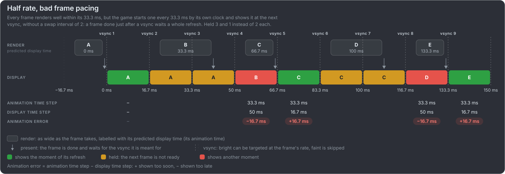

# Vocabulary

This project uses the vocabulary of [Intel PresentMon](https://github.com/GameTechDev/PresentMon) and the
[Gamers Nexus animation error methodology](https://gamersnexus.net/gpus-gn-extras-cpus/problem-gpu-benchmarks-reality-vs-numbers-animation-error-methodology-white).
The same ideas go by other names in engines, platform libraries, Digital Foundry's videos and older GPU reviews; the table maps
them, and to the video modes. [mb-framepacing](https://github.com/Unarmed1000/mb-framepacing/blob/master/sdk/doc/vocabulary.md) uses
the same terms and lists where each appears in its CSV and charts. The sources are collected in [further reading](further-reading.md).

## Terms

| Term (as used here)            | Meaning                                                                                                                                                                                                                                                                                                                                                                                                                                                                                                                                                                                          | Other names                                                                                                                                                                                                                                                                                                                                                                                                                                          | Origin                                                                                                                                                                                                                                                                                                                                                                                                                                                                                                                                                                                                                             | In the videos                                                                                                                                                                                                                                                                                                               |
| ------------------------------ | ------------------------------------------------------------------------------------------------------------------------------------------------------------------------------------------------------------------------------------------------------------------------------------------------------------------------------------------------------------------------------------------------------------------------------------------------------------------------------------------------------------------------------------------------------------------------------------------------ | ---------------------------------------------------------------------------------------------------------------------------------------------------------------------------------------------------------------------------------------------------------------------------------------------------------------------------------------------------------------------------------------------------------------------------------------------------- | ---------------------------------------------------------------------------------------------------------------------------------------------------------------------------------------------------------------------------------------------------------------------------------------------------------------------------------------------------------------------------------------------------------------------------------------------------------------------------------------------------------------------------------------------------------------------------------------------------------------------------------- | --------------------------------------------------------------------------------------------------------------------------------------------------------------------------------------------------------------------------------------------------------------------------------------------------------------------------- |
| **Animation error**            | How far the animation time advanced between two frames shown one after the other, minus how long the first of them was on screen. Positive: shown too soon (moved too far). Negative: shown too late (moved too little).                                                                                                                                                                                                                                                                                                                                                                         | Simulation time error (Intel's earlier name); `MsAnimationError` (PresentMon CSV). Gamers Nexus: "a way to measure microstutter, but not microstutter itself"                                                                                                                                                                                                                                                                                        | [PresentMon](https://github.com/GameTechDev/PresentMon/blob/main/README-ConsoleApplication.md#csv-columns); explained by [Gamers Nexus](https://gamersnexus.net/gpus-gn-extras-cpus/problem-gpu-benchmarks-reality-vs-numbers-animation-error-methodology-white) (2025)                                                                                                                                                                                                                                                                                                                                                            | Zero for the ideal timer (`60`, `30`, `20`); the naive timer shows some every frame, the busy scheduler in spikes                                                                                                                                                                                                           |
| **Animation time**             | The moment of game time a frame shows, "the world at 12.345 s".                                                                                                                                                                                                                                                                                                                                                                                                                                                                                                                                  | Simulation time, game time, animation timer; `AnimationTime` (PresentMon: usually the CPU start of the frame, or its simulation start with Reflex, XeLL or Anti-Lag 2)                                                                                                                                                                                                                                                                               | PresentMon, Gamers Nexus                                                                                                                                                                                                                                                                                                                                                                                                                                                                                                                                                                                                           | Where the box is drawn: the motion at the frame's animation time (the wall clock reading for the naive timer)                                                                                                                                                                                                               |
| **Animation time step**        | How far the animation time advanced from one shown frame to the next.                                                                                                                                                                                                                                                                                                                                                                                                                                                                                                                            | Delta time, `Time.deltaTime` (Unity), timestep, CPU delta (PresentMon: "the previous frame's CPU delta"); `MsBetweenSimulationStart` (PresentMon, with simulation start markers)                                                                                                                                                                                                                                                                     | Engines ([Unity](https://unity.com/blog/engine-platform/fixing-time-deltatime-in-unity-2020-2-for-smoother-gameplay)), PresentMon                                                                                                                                                                                                                                                                                                                                                                                                                                                                                                  | Exactly 1 / rate with the ideal timer; `dt = now − last` of the wall clock with the naive timer                                                                                                                                                                                                                             |
| **Predicted display time**     | When the game expects a frame to be shown, which becomes its animation time. The game predicts it from the recent frame times (the last one, or several smoothed) and the frame pacing it aims for: a whole number of refreshes that fits the refresh period, even when it is not one refresh (30 fps on 60 Hz is two). A wrong prediction, a frame over its budget or an uneven clock reading, is where animation error comes from.                                                                                                                                                             | `predictedDisplayTime` (OpenXR; Meta: "when the frame is supposed to be displayed"); expected presentation time (Android Choreographer: "should be used to advance any animation clocks"); requested or desired presentation time, presentation timestamps (Swappy, `EGL_ANDROID_presentation_time`); `targetTimestamp` (Apple `CADisplayLink`); `desiredPresentTime`, target present time (Vulkan). PresentMon and Gamers Nexus have no name for it | [OpenXR](https://registry.khronos.org/OpenXR/specs/1.0/man/html/XrFrameState.html), [Meta: A VR Frame's Life](https://developers.meta.com/horizon/blog/a-vr-frames-life/), [Android Choreographer](https://developer.android.com/ndk/reference/group/choreographer), [Android Frame Pacing](https://developer.android.com/games/sdk/frame-pacing), [Apple](https://developer.apple.com/documentation/quartzcore/cadisplaylink/targettimestamp), [Vulkan](https://docs.vulkan.org/refpages/latest/refpages/source/VkPresentTimingInfoEXT.html); smoothing: [Frank Force](https://frankforce.com/frame-rate-delta-buffering/)        | The ideal timer hits it exactly; the naive timer uses the last frame's wall clock step. In the [timing diagrams](../README.md#frame-pacing-in-one-minute) it is the time in each render box                                                                                                                                 |
| **Display time**               | The moment a frame appeared on screen: the vsync it was flipped at, or on a VRR display when the refresh began.                                                                                                                                                                                                                                                                                                                                                                                                                                                                                  | Present time, actual present time (`actualPresentTime`, Vulkan `VK_GOOGLE_display_timing`)                                                                                                                                                                                                                                                                                                                                                           | Graphics APIs; the name pairs it with the animation time                                                                                                                                                                                                                                                                                                                                                                                                                                                                                                                                                                           | Always a vsync                                                                                                                                                                                                                                                                                                              |
| **Display time step**          | How long the previous frame stayed on screen before this one appeared: the step from its display time to this one's.                                                                                                                                                                                                                                                                                                                                                                                                                                                                             | Display delta, `MsBetweenDisplayChange` (PresentMon), display frame time. Overlays often call it "frame time", which PresentMon and Gamers Nexus keep for the CPU side (below)                                                                                                                                                                                                                                                                       | PresentMon, Gamers Nexus; the name pairs it with the animation time step                                                                                                                                                                                                                                                                                                                                                                                                                                                                                                                                                           | Always 1, 2 or 3 refreshes at 60/30/20 Hz: every frame makes its vsync                                                                                                                                                                                                                                                      |
| **On-screen time**             | How long this frame stayed on screen.                                                                                                                                                                                                                                                                                                                                                                                                                                                                                                                                                            | `DisplayedTime` (PresentMon)                                                                                                                                                                                                                                                                                                                                                                                                                         | PresentMon                                                                                                                                                                                                                                                                                                                                                                                                                                                                                                                                                                                                                         |                                                                                                                                                                                                                                                                                                                             |
| **Frametime**                  | The time from the CPU starting one frame to starting the next: the application side, not the display.                                                                                                                                                                                                                                                                                                                                                                                                                                                                                            | `MsBetweenAppStart`, `MsBetweenPresents` (PresentMon, present to present), frame time, CPU frame time; "Frame" in Unreal's `stat unit`. Gamers Nexus: present to present is "technically a different thing" from the display time step                                                                                                                                                                                                               | PresentMon, Gamers Nexus, [Unreal Engine](https://dev.epicgames.com/documentation/en-us/unreal-engine/stat-commands-in-unreal-engine)                                                                                                                                                                                                                                                                                                                                                                                                                                                                                              | Rendering always fits (`--frame-cost`); over-budget frames are not simulated yet                                                                                                                                                                                                                                            |
| **Frame-time graph**           | Frame times (usually the display side) plotted frame by frame; a flat line is even pacing, a sawtooth is not.                                                                                                                                                                                                                                                                                                                                                                                                                                                                                    | Frametime plot, frame time graph                                                                                                                                                                                                                                                                                                                                                                                                                     | Reviews: Digital Foundry, Gamers Nexus, [PC Perspective](https://pcper.com/2013/03/frame-rating-dissected-full-details-on-capture-based-graphics-performance-testing/4/); tools such as CapFrameX and PresentMon                                                                                                                                                                                                                                                                                                                                                                                                                   | See [charts](charts.md)                                                                                                                                                                                                                                                                                                     |
| **Frame pacing**               | How evenly frames reach the screen.                                                                                                                                                                                                                                                                                                                                                                                                                                                                                                                                                              | Frame delivery, cadence. Digital Foundry: "inconsistent/'bad' frame-pacing" for a 30 fps game whose frames are not held evenly. The [Android Frame Pacing library](https://developer.android.com/games/sdk/frame-pacing) (Swappy) uses it for syncing the render loop to the display                                                                                                                                                                 | Common usage; [PC Perspective / AMD Catalyst 13.8](https://pcper.com/2013/08/frame-rating-catalyst-13-8-brings-frame-pacing-to-amd-radeon/) (2013); [Digital Foundry](https://www.youtube.com/watch?v=M7bWbWUKHmM); Android                                                                                                                                                                                                                                                                                                                                                                                                        | Always even: frames are shown at every vsync                                                                                                                                                                                                                                                                                |
| **Stutter**                    | What the eye sees: motion that suddenly speeds up or slows down.                                                                                                                                                                                                                                                                                                                                                                                                                                                                                                                                 | Judder, jerkiness, hitching; see shader compilation and traversal stutter (below)                                                                                                                                                                                                                                                                                                                                                                    | Common usage; Gamers Nexus describe it as visible acceleration or deceleration                                                                                                                                                                                                                                                                                                                                                                                                                                                                                                                                                     | What every non-perfect mode is meant to show                                                                                                                                                                                                                                                                                |
| **Hitch**                      | A single, severe frametime spike.                                                                                                                                                                                                                                                                                                                                                                                                                                                                                                                                                                | Spike, long frame. PC Perspective: "a large single frame rate issue that isn't indicative of a microstutter smoothness problem"                                                                                                                                                                                                                                                                                                                      | Unreal Engine (`t.HitchFrameTimeThreshold`, `stat DumpHitches`: [stat commands](https://dev.epicgames.com/documentation/en-us/unreal-engine/stat-commands-in-unreal-engine), [Intel's Unreal Engine guide](https://www.intel.com/content/www/us/en/developer/articles/technical/unreal-engine-optimization-profiling-fundamentals.html)), Gamers Nexus, [PC Perspective](https://pcper.com/2013/03/frame-rating-dissected-full-details-on-capture-based-graphics-performance-testing/)                                                                                                                                             | Not simulated yet (late frames)                                                                                                                                                                                                                                                                                             |
| **Shader compilation stutter** | A hitch the first time a shader (in practice a pipeline state, PSO) is needed: rendering waits while the driver compiles it, which can take tens of milliseconds.                                                                                                                                                                                                                                                                                                                                                                                                                                | PSO compilation hitch; #StutterStruggle (Digital Foundry's series on PC stutter)                                                                                                                                                                                                                                                                                                                                                                     | [Epic](https://www.unrealengine.com/tech-blog/game-engines-and-shader-stuttering-unreal-engines-solution-to-the-problem) ([PSO precaching](https://dev.epicgames.com/documentation/en-us/unreal-engine/pso-precaching-for-unreal-engine)); [Digital Foundry](https://www.youtube.com/watch?v=uI6eAVvvmg0)                                                                                                                                                                                                                                                                                                                          | Not simulated                                                                                                                                                                                                                                                                                                               |
| **Traversal stutter**          | Hitches while moving through the game world. Digital Foundry name it separately from shader compilation stutter.                                                                                                                                                                                                                                                                                                                                                                                                                                                                                 | Part of #StutterStruggle                                                                                                                                                                                                                                                                                                                                                                                                                             | [Digital Foundry](https://www.youtube.com/watch?v=MvQl7EDPRC4&t=267s)                                                                                                                                                                                                                                                                                                                                                                                                                                                                                                                                                              | Not simulated                                                                                                                                                                                                                                                                                                               |
| **Short / long frame**         | A frame shown sooner or later than the display rhythm expects. Short frames followed by long frames are seen as stutter. Long frames can also fill the queue ("stuffed buffers") and add latency.                                                                                                                                                                                                                                                                                                                                                                                                | Frame shown too soon / too late                                                                                                                                                                                                                                                                                                                                                                                                                      | [Android Frame Pacing library](https://developer.android.com/games/sdk/frame-pacing)                                                                                                                                                                                                                                                                                                                                                                                                                                                                                                                                               | Not simulated yet                                                                                                                                                                                                                                                                                                           |
| **Delta time jitter**          | The engine's measured delta time varies while frames reach the screen evenly, so motion shakes slightly at a steady frame rate. Unity measured 6.854, 7.423 and 6.691 ms at a steady 144 Hz (6.944 ms frames). Frame rate, frametime and display time step cannot see it; only animation error does.                                                                                                                                                                                                                                                                                             | Timestep jitter, inconsistent `Time.deltaTime`; timer jitter (informal)                                                                                                                                                                                                                                                                                                                                                                              | [Unity 2020.2](https://unity.com/blog/engine-platform/fixing-time-deltatime-in-unity-2020-2-for-smoother-gameplay)                                                                                                                                                                                                                                                                                                                                                                                                                                                                                                                 | The naive timer: `-naive-light` / `-typical` / `-heavy` (system load: now and then a read about 1–2 ms sooner or later, heavy load also 4–8 ms spikes; a demo profile with an error in 95 % of the frames, `-realistic` for the real rates), `-naive-1ms` … `-4ms` (a ±N ms window), `-naive-synthetic` (a made-up pattern) |
| **Microstutter**               | Uneven frame delivery while the average frame rate looks fine. The term comes from multi-GPU (SLI/CrossFire) alternate frame rendering, with its "runt frames".                                                                                                                                                                                                                                                                                                                                                                                                                                  | Micro stuttering, micro-stutter; uneven frame pacing                                                                                                                                                                                                                                                                                                                                                                                                 | Multi-GPU era: [The Tech Report](http://web.archive.org/web/20131014012307/http://techreport.com/review/21516/inside-the-second-a-new-look-at-game-benchmarking/11) (2011), [PC Perspective](https://pcper.com/2013/03/frame-rating-dissected-full-details-on-capture-based-graphics-performance-testing/) (2013); [Wikipedia](https://en.wikipedia.org/wiki/Micro_stuttering), Gamers Nexus                                                                                                                                                                                                                                       | Closest: a ±N ms window with `--jitter-pattern alternating` (short/long dts every frame)                                                                                                                                                                                                                                    |
| **Runt frame**                 | A frame shown for only a sliver of a refresh, so it hardly counts for the eye while raising the frame rate. PC Perspective: "thin bands of color in our captured video, that we have determined do not add to the animation of the image on the screen".                                                                                                                                                                                                                                                                                                                                         | Partial frame. "Observed FPS" is the frame rate without runts and dropped frames (PC Perspective)                                                                                                                                                                                                                                                                                                                                                    | Multi-GPU testing: [PC Perspective / NVIDIA FCAT](https://pcper.com/2013/03/frame-rating-dissected-full-details-on-capture-based-graphics-performance-testing/4/) (2013); Gamers Nexus                                                                                                                                                                                                                                                                                                                                                                                                                                             | Not simulated                                                                                                                                                                                                                                                                                                               |
| **Judder**                     | Uneven display durations for content moving at a constant speed; also the jiggle in VR when frames miss the display.                                                                                                                                                                                                                                                                                                                                                                                                                                                                             | Stutter; pulldown judder (24p on 60 Hz). Meta: "Objects appear to stutter or vibrate because their positions jump between old and new frames"; a frame shown again because the new one was late is a "stale" frame                                                                                                                                                                                                                                   | Video and film; VR ([Meta: missed frames](https://developers.meta.com/horizon/documentation/unity/os-missed-frames/), [Asynchronous Timewarp](https://developers.meta.com/horizon/blog/asynchronous-timewarp-on-oculus-rift/)); [Fora Soft](https://www.forasoft.com/learn/video-quality/articles-vqm/judder-stutter-frame-rate-artifacts)                                                                                                                                                                                                                                                                                         | The ideal `30` and `20` modes hold each frame 2 or 3 refreshes; the follow scene shows it against the lines                                                                                                                                                                                                                 |
| **Dropped frame**              | A frame that was rendered but never shown.                                                                                                                                                                                                                                                                                                                                                                                                                                                                                                                                                       | Skipped frame; "drops" (PC Perspective); PresentMon reports `DisplayedTime` as "NA"                                                                                                                                                                                                                                                                                                                                                                  | Common usage; PresentMon                                                                                                                                                                                                                                                                                                                                                                                                                                                                                                                                                                                                           | Only in the `-dropped-frames` test clip for mb-framepacing (runs of 1 to 4 frames never shown); the page's videos show every rendered frame                                                                                                                                                                                 |
| **Wall clock**                 | A high-precision timer the game reads itself (QueryPerformanceCounter, `std::chrono::steady_clock`). On plain vsync the game cannot know when a frame was shown, so it reads the clock when its thread runs again after `Present`.                                                                                                                                                                                                                                                                                                                                                               | High-resolution timer, performance counter; CPU time                                                                                                                                                                                                                                                                                                                                                                                                 | Engines; [Croteam (Alen Ladavac)](https://medium.com/@alen.ladavac/the-elusive-frame-timing-168f899aec92)                                                                                                                                                                                                                                                                                                                                                                                                                                                                                                                          | The naive timer: `dt = now − last`                                                                                                                                                                                                                                                                                          |
| **Swap interval**              | How many vsyncs a frame stays on screen before the next one: 1, 2 or 3 for 60, 30 or 20 Hz on a 60 Hz display.                                                                                                                                                                                                                                                                                                                                                                                                                                                                                   | Present interval, vsync interval                                                                                                                                                                                                                                                                                                                                                                                                                     | Graphics APIs (`eglSwapInterval`, `SyncInterval`), [Android Frame Pacing](https://developer.android.com/games/sdk/frame-pacing)                                                                                                                                                                                                                                                                                                                                                                                                                                                                                                    | 60, 30 and 20 Hz modes                                                                                                                                                                                                                                                                                                      |
| **Drift**                      | The difference between animation time and display time, accumulated over the run.                                                                                                                                                                                                                                                                                                                                                                                                                                                                                                                | Related: rubber-banding (Gamers Nexus: motion that stalls, then jumps ahead)                                                                                                                                                                                                                                                                                                                                                                         | mb-framepacing                                                                                                                                                                                                                                                                                                                                                                                                                                                                                                                                                                                                                     | None: every clip loops back to where it started                                                                                                                                                                                                                                                                             |
| **Tearing**                    | With vsync off, one refresh shows parts of two or more frames, split by a visible line.                                                                                                                                                                                                                                                                                                                                                                                                                                                                                                          | Screen tearing; vsync off, `IMMEDIATE` (Vulkan), `ALLOW_TEARING` (DXGI)                                                                                                                                                                                                                                                                                                                                                                              | [NVIDIA](https://www.nvidia.com/en-us/geforce/news/introducing-nvidia-g-sync-revolutionary-ultra-smooth-stutter-free-gaming/), graphics APIs; see [vsync](display-sync.md#vsync)                                                                                                                                                                                                                                                                                                                                                                                                                                                   | Not simulated                                                                                                                                                                                                                                                                                                               |
| **VRR**                        | Variable refresh rate: the display refreshes when a frame arrives, within its range.                                                                                                                                                                                                                                                                                                                                                                                                                                                                                                             | G-SYNC (NVIDIA), FreeSync (AMD), VESA Adaptive-Sync, HDMI VRR; LFC (low framerate compensation) below the range                                                                                                                                                                                                                                                                                                                                      | Displays and GPUs; see [VRR](display-sync.md#variable-refresh-rate-vrr)                                                                                                                                                                                                                                                                                                                                                                                                                                                                                                                                                            | Not simulated                                                                                                                                                                                                                                                                                                               |
| **Frame smoothing**            | Generated frames inserted between rendered ones: smoother motion, **not a performance improvement**. The displayed frame rate goes up, but the game still reads input and advances its animation at the rendered rate. **It costs input latency**: the newest rendered frame is held back to generate the one before it, and generating frames lowers the rendered rate (Hardware Unboxed: from a 110 fps "feel" to 79 fps). **It needs a high frame rate to begin with**: Hardware Unboxed recommend "a starting frame rate of 100 to 120 FPS", 70 to 80 fps at the least; AMD at least 60 fps. | Frame generation, FG; multi frame generation, MFG (NVIDIA DLSS 3 and 4); FSR frame generation (AMD); XeSS frame generation (Intel); driver-level: Smooth Motion (NVIDIA), Fluid Motion Frames, AFMF (AMD). "Fake frames" (Gamers Nexus). Hardware Unboxed: "it's a frame smoothing technology, nothing more". On TVs: motion interpolation, motion smoothing                                                                                         | [Hardware Unboxed](https://x.com/HardwareUnboxed/status/1876528043885539414) ([DLSS 4 Multi Frame Generation review](https://www.techspot.com/article/2945-nvidia-dlss-4/), [Frame Generation Doesn't Fix Bad Performance!](https://www.youtube.com/watch?v=Dn9zNs0XZDk)); [Gamers Nexus: "Fake Frames" Tested](https://gamersnexus.net/gpus/fake-frames-tested-dlss-40-mfg-4x-nvidias-misleading-review-guide); [AMD FSR frame generation](https://gpuopen.com/amd-fsr-framegeneration/); TVs: [motion interpolation](https://en.wikipedia.org/wiki/Motion_interpolation); see [input latency](input-latency.md#frame-generation) | Not simulated                                                                                                                                                                                                                                                                                                               |
| **Input lag**                  | How long from an input until its result is on screen.                                                                                                                                                                                                                                                                                                                                                                                                                                                                                                                                            | Input latency, end-to-end system latency, click-to-display (NVIDIA), click-to-photon (`MsClickToPhotonLatency`, PresentMon), PC latency (`MsPCLatency`), button to pixel (Digital Foundry)                                                                                                                                                                                                                                                           | NVIDIA, PresentMon; see [input latency](input-latency.md)                                                                                                                                                                                                                                                                                                                                                                                                                                                                                                                                                                          | Not simulated                                                                                                                                                                                                                                                                                                               |

## The two ways animation error happens

Gamers Nexus explain it with a flipbook:

| Case                                                                                  | Flipbook                                        | Typical cause                                                                                  | Video modes                                                 |
| ------------------------------------------------------------------------------------- | ----------------------------------------------- | ---------------------------------------------------------------------------------------------- | ----------------------------------------------------------- |
| Frames reach the screen evenly, but the **animation time** advances unevenly          | Unevenly drawn pages, flipped at a steady tempo | Delta time jitter: the engine reads its wall clock at an uneven point after each flip          | `-naive-light`, `-typical`, `-heavy`, `-naive-1ms` … `-4ms` |
| The animation time advances evenly, but frames reach the screen unevenly (**pacing**) | Evenly drawn pages, flipped at an uneven tempo  | A frame over its budget shows a refresh late (a hitch); one submitted too early shows too soon | Not simulated yet                                           |

Both give the same kind of number: how far each frame's motion is off from the time it was actually on screen. Charts that show
both sides next to each other are in [charts](charts.md).

**Delta time jitter is invisible to the usual numbers.** Frame rate, frametime, display time step and a frame-time graph are
identical to the perfect timer's: every frame is on screen for exactly one refresh. The eye still sees slightly uneven motion,
and only animation error shows why, because only it looks at the moment each frame shows:

The diagrams follow both clocks at a 60 Hz display (a refresh every 16.7 ms, as in the videos). A perfect timer, for comparison:

## Digital Foundry's terms

Digital Foundry use their own names for these problems throughout their console and PC analyses. They map to the terms above:

| Digital Foundry                                                                                                                                                                                                                                                                                                                                                                                        | Here                                                          | In the videos                            |
| ------------------------------------------------------------------------------------------------------------------------------------------------------------------------------------------------------------------------------------------------------------------------------------------------------------------------------------------------------------------------------------------------------ | ------------------------------------------------------------- | ---------------------------------------- |
| **Bad 30 fps frame pacing**: a 30 fps game on a 60 Hz display whose frames are not held for an even two refreshes. [Bloodborne](https://www.digitalfoundry.net/articles/digitalfoundry-2015-bloodborne-performance-analysis) (2015) "often produces two unique frames followed by two duplicates", with frame times swinging "between 16ms and 66ms" (bad pacing together with real performance drops) | Frame pacing: short and long frames                           | Not simulated yet; `30` is the good case |
| **Shader compilation stutter**, **traversal stutter**, **#StutterStruggle** (e.g. [Star Wars Jedi Survivor](https://www.youtube.com/watch?v=uI6eAVvvmg0), [Dead Space](https://www.youtube.com/watch?v=MvQl7EDPRC4))                                                                                                                                                                                   | Hitches                                                       | Not simulated                            |
| **40 fps at 120 Hz**: "Ratchet updates every 25ms (40fps) at 120Hz, the same consistency but smoother" ([video](https://www.youtube.com/watch?v=QXi7uO7wxdc))                                                                                                                                                                                                                                          | Swap interval 3 on a 120 Hz display; even pacing              | Not generated                            |
| **Frame-time graph**                                                                                                                                                                                                                                                                                                                                                                                   | Display time step per frame                                   | See [charts](charts.md)                  |
| **VRR**, **LFC**                                                                                                                                                                                                                                                                                                                                                                                       | See [display sync](display-sync.md#variable-refresh-rate-vrr) | Not simulated                            |
| **Button to pixel** latency                                                                                                                                                                                                                                                                                                                                                                            | Input lag                                                     | Not simulated                            |

Their bad 30 fps frame pacing: the animation steps evenly and every frame renders in time, but the frames are held for three
and one refreshes instead of two.

More of their videos are listed in [further reading](further-reading.md#digital-foundry).
