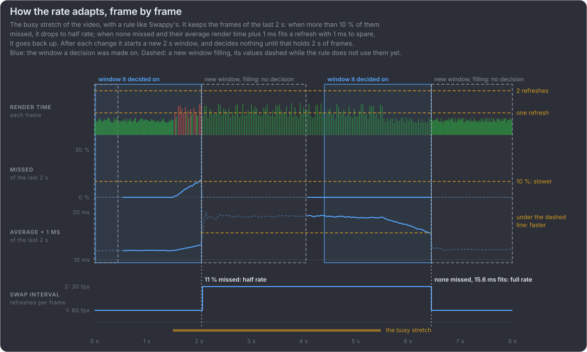
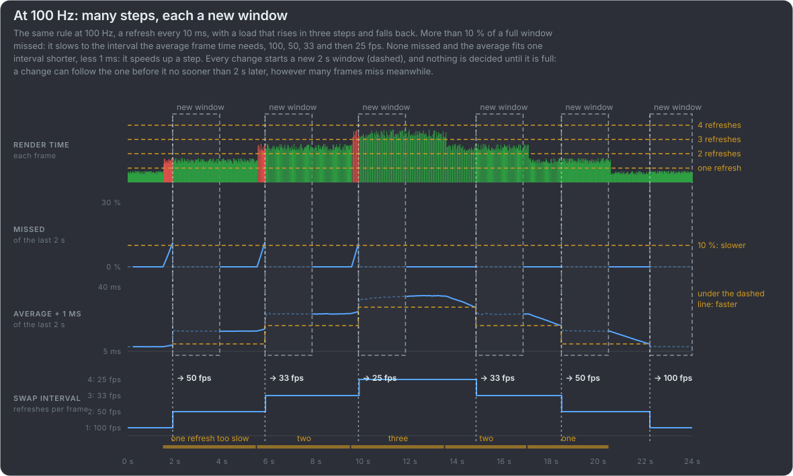

# Adapt the rate to the frames

For when frames miss again and again through a busy stretch. If a frame misses only now and then, because the host operating
system or a driver took the CPU or GPU for a moment, or the load spiked once, there is nothing to adapt: the job is to mitigate
that one miss, and keep it from turning into more. Adapting the rate is for the stretches: a lower rate only where it is needed,
full rate while the frames fit, half rate through a busy stretch, and back up when they fit again.

:::video pair fast 60-busy-full-rate 60-busy-swappy chart frames

A 4 s busy stretch in which frames take 12 to 24 ms, around the 16.7 ms refresh, with calm frames before and after it. Top: kept
at full rate, frames take one refresh or two, unevenly, for the whole stretch. Bottom: the rate adapts like Swappy's rule: more
than 10 % of the last 2 s missed, so it drops to a steady half rate, and goes back up once no frame of the last 2 s missed and
their average fits a refresh with room to spare.

:::

Swappy: [Android's Frame Pacing library](https://developer.android.com/games/sdk/frame-pacing)
[its rule, in SwappyCommon.cpp (updateSwapInterval)](https://android.googlesource.com/platform/frameworks/opt/gamesdk/+/refs/heads/main/games-frame-pacing/common/SwappyCommon.cpp)
{.more}

Reading the display time chart: each step is one frame, as long as it stays on screen. A flat line is smooth motion, at 16.7 ms full
rate, at 33.3 ms half rate; a line jumping between the two is stutter, frames on screen for uneven times. A red step is a frame
shown after the refresh it was rendered for. Where a frame is later than the one before it, the animation error chart above shows
a bar; a run of frames all one refresh late moves evenly, only delayed. Top: the line jumps
for the whole busy stretch. Bottom: it jumps for half a second, until the rule has seen enough misses, then holds at 33.3 ms and
steps back down to 16.7 ms once the stretch is over. {.note}

This is **frame pacing** again: how evenly frames reach the screen, not only how many do. Through the busy stretch the top half
shows more frames, but unevenly paced; the bottom half fewer, evenly paced, and it is the one that moves smoothly. Android's
library for it carries the name: the [Frame Pacing library](https://developer.android.com/games/sdk/frame-pacing) (Swappy). {.note}

Dropping to half rate means holding every frame for exactly two refreshes and stepping the animation by two: [How to pace 30
fps](#/half-rate) shows how it can be done, with the swap interval and scheduled present APIs of each platform. {.note}

:::video file adaptive-history 574 controls

The bottom box of the video above, with the history its rule keeps: the frames of the last 2 s, newest on the right, and the two
numbers it decides by. More than 10 % of the window missed: it drops to half rate and starts a new window. A steady half rate
through the busy stretch, none missed; once the average fits a refresh with room to spare, it goes back to full rate.

:::

At a higher refresh rate there are more steps than full and half rate: at 100 Hz, a refresh every 10 ms, the swap interval can
give 100, 50, 33, 25 and 20 fps, and the rule steps through them as the load needs, one change at least 2 s after the one before.
{.note}

**A possible improvement, my own and not tried yet.** After every change Swappy waits for a full new 2 s window before it
decides anything again, so after going back up it can miss frames for up to 2 s before it drops again. I do not know why it waits:
its code and documentation do not say. The window's length is what tells a busy stretch from a one-off spike: more than 10 % of 2 s of
frames is several misses, not one: misses > 10 % × 2 s × the frame rate reached. So it could slow down as soon as the misses of
the last 2 s pass that count, even before a new window is full, which is no less safe against a single spike and much sooner;
and keep waiting for a full window without a miss before it speeds up again, where waiting costs little, as the game still runs
smoothly. I have not tried this. {.note}
