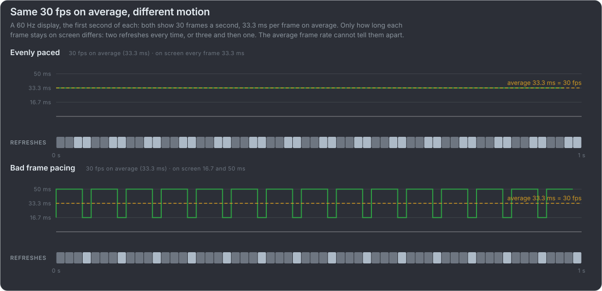

# The average frame rate hides stutter

An average frame rate counts frames, not when they reach the screen. Both rows below are 30 fps on a 60 Hz display, 30 frames
every second, and every frame renders in time: the top one holds each frame for two refreshes, the bottom one for three and then
one, and only the top one is smooth. The average cannot tell them apart.

:::video pair fast 60-diagram-half-rate-even 60-diagram-half-rate-bad-pacing nochart

Both boxes at 30 fps, 30 frames every second. Top: every frame held for two refreshes. Bottom: for three and then one.

:::

:::card What each number sees

| Number                          | Bad frame pacing                          | [Delta time jitter](#/invisible)           |
| ------------------------------- | ----------------------------------------- | ------------------------------------------ |
| **Average frame rate**          | 30 fps, the same as evenly paced          | 60 fps, the same as a perfect timer        |
| **Display time step per frame** | Uneven: 50 and 16.7 ms instead of 33.3 ms | Even: 16.7 ms, the same as a perfect timer |
| **Animation error**             | ±16.7 ms                                  | Up to ±5 ms in the videos                  |

A graph of display time steps catches bad pacing, but only animation error catches both causes of stutter, because only it looks at
the moment each frame shows. {.note}

:::
