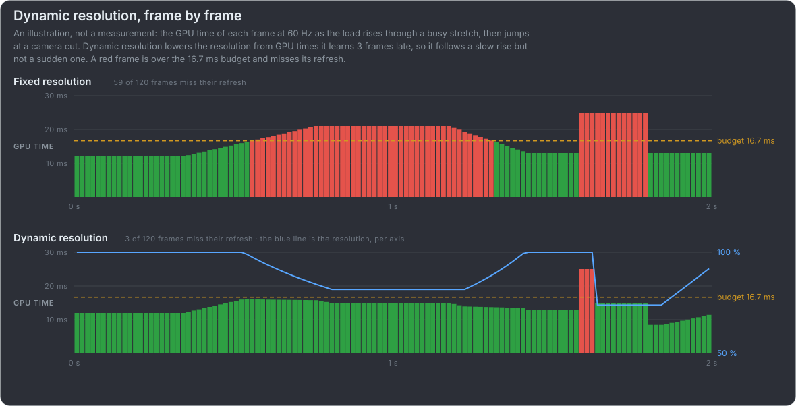
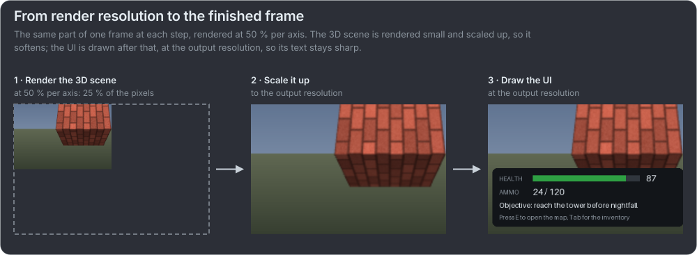

# Dynamic resolution: keep the frame rate, lower the work

Not a pacing strategy, but a way to stay within the frame budget: when the GPU gets busy, render fewer pixels and scale them up to
the display, so the frame still makes its refresh. In Unreal it "adjusts the primary screen percentage according to the previous
frames' GPU workload"; in Unity "you can gradually scale down the resolution to maintain a consistent frame rate. If scaled
gradually, dynamic resolution can be almost unnoticeable." It costs image quality, and it is common on consoles: "most games use some kind of dynamic resolution" (on Xbox,
[Microsoft](https://learn.microsoft.com/en-us/gaming/sustainability/xbox-game-energy-efficiency-essentials)).

:::video file dynamic-resolution

Rotating, textured 3D objects whose render scale follows the load, down to 60 % per axis, scaled up to 1280 x 384: the scene
softens a little, while the HUD, drawn at full resolution, stays sharp. An illustration: the scale follows the curve of the chart
below, deepened to 60 %, at half speed.

:::

:::guide

:::card How it works

- **Measure the GPU time** of the frames just rendered. The results come late: Unity reads GPU timing "with three frames delay"
  ([frame timing](https://docs.unity3d.com/6000.3/Documentation/Manual/frame-timing-manager.html)).
- **Pick the next frames' resolution** within a range, against a budget: in
  [Unreal](https://dev.epicgames.com/documentation/en-us/unreal-engine/dynamic-resolution-in-unreal-engine) from 50 to 100 %
  of the screen by default (`r.DynamicRes.MinScreenPercentage`, `MaxScreenPercentage`), against `r.DynamicRes.FrameTimeBudget`.
  In [Unity](https://docs.unity3d.com/6000.3/Documentation/Manual/DynamicResolution-control.html) the app sets the scale itself
  (`ScalableBufferManager.ResizeBuffers`).
- **Scale up to a fixed output:** a [temporal upscaler](#/upscalers) takes the changing resolution. DLSS: "the input buffer can
  change dimensions from frame to frame whilst the output size remains fixed"
  ([NVIDIA](https://github.com/NVIDIA/DLSS/blob/main/doc/DLSS_Programming_Guide_Release.pdf)); Intel's XeSS works the same way,
  and Unreal's TSR does on consoles.

:::

:::card What it cannot do

- **See a spike coming.** It follows frames already rendered, and Unreal's heuristic "can't actually predict" a camera cut or an
  expensive effect: a "panic" switch lowers the resolution only after several frames over budget, and those frames miss.
- **Help a CPU-bound frame.** In a GPU-bound application, "lowering the rendering resolution often improves the frame rate
  significantly, but the same change might not make a big difference for a CPU-bound application"
  ([Unity](https://docs.unity3d.com/Packages/com.unity.adaptiveperformance@5.1/manual/user-guide.html)).
- **Scale all the work.** For example, "shadow map rendering, particle update, culling or acceleration structure building normally do not
  scale" ([Martin Fuller](https://martinfullerblog.wordpress.com/2023/10/11/dynamic-resolution-scaling-drs-implementation-best-practice/)).

:::

:::

## How low it can go

Unity: "It is best practice to keep the screen percentage above 50%"
([HDRP](https://docs.unity3d.com/Packages/com.unity.render-pipelines.high-definition@17.0/manual/Dynamic-Resolution.html)).
Below, the same scene jumping from full resolution to that minimum, and to half of it. {.note}

:::video file dynamic-resolution-minimum

Jumping between 100 % and 50 % per axis, the lowest recommended: the textures and edges soften, but the scene holds up.

:::

:::video file dynamic-resolution-too-low

Jumping between 100 % and 25 % per axis, a sixteenth of the pixels: too low. The bricks and the checkerboard blur and the edges
break up.

:::

## Keep the UI at the output resolution

The 3D scene hides a lower resolution well; text and thin UI lines do not. So the UI is drawn after scaling up, at the output
resolution. Intel: "Graphical user interface components can then be rendered at the back buffer resolution, as these are typically
less expensive elements to draw" ([Intel](https://gamedev.net/tutorials/programming/graphics/dynamic-resolution-rendering-r2821)).
{.note}

:::video file dynamic-resolution-ui

The same UI twice while the scene jumps between 100 % and 50 % per axis: on the left drawn at the render resolution and scaled up
with the scene, its text blurs; on the right drawn at the output resolution, it stays sharp.

:::

:::card Where it fits

- **Consoles:** played on a TV from across the room, where a softer picture is harder to see. The console also knows each frame's
  GPU time at once, so it has more time to lower the resolution before a frame misses
  ([Martin Fuller](https://martinfullerblog.wordpress.com/2025/01/06/dynamic-resolution-scaling-on-pc/)).
- **PC:** less common. The player sits close to the screen; a separate graphics card reports its GPU times later, over the bus;
  and mouse look changes the view faster than a controller, so the next frame's load is harder to predict (Martin Fuller, the
  same). Digital Foundry asked
  "[Why Don't More PC Games Support Dynamic Resolution Scaling (When Consoles Do?)](https://www.youtube.com/watch?v=AoMPQG1w_O8)".
  Our suggestion for PC: offer it as an option, off by default.

:::

:::card In console performance modes

| Game                             | Dynamic resolution in the 60 fps mode, as Digital Foundry measured it                                                                                                                                                                                            |
| -------------------------------- | ---------------------------------------------------------------------------------------------------------------------------------------------------------------------------------------------------------------------------------------------------------------- |
| Marvel's Spider-Man 2, PS5       | "Performance mode is 60fps, with dynamic resolutions ranging from 1008p to 1440p" ([2023](https://www.digitalfoundry.net/articles/digitalfoundry-2023-marvels-spider-man-2-tech-review))                                                                         |
| Cyberpunk 2077 (patch 1.50), PS5 | "a 1260p to 1728p dynamic resolution window - a respectable turn-out for a challenging game gunning for 60fps" ([2022](https://www.digitalfoundry.net/articles/digitalfoundry-2022-cyberpunk-2077-next-gen-patch-the-digital-foundry-verdict))                   |
| Lies of P, PS5 and Series X      | "an internal resolution that ranges from 1512p to 1800p" ([2023](https://www.digitalfoundry.net/articles/digitalfoundry-2023-lies-of-p-tech-review-ps5-and-series-x-s))                                                                                          |
| Star Wars Jedi: Survivor, PS5    | "between 648p and 864p", and still "dropping down as far as the 30s in some sections" ([2023](https://www.digitalfoundry.net/articles/digitalfoundry-2023-star-wars-jedi-survivors-ray-tracing-impresses-on-ps5-but-also-causes-the-biggest-performance-issues)) |

:::

It works next to the pacing strategies, not instead of them: it keeps most frames within the budget, and a
[strategy](#/missed-frames) still has to handle the ones that miss. {.note}
