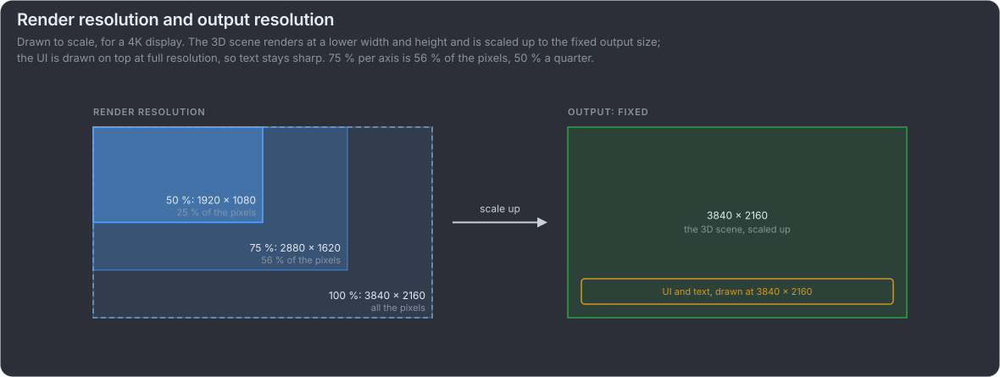

# Render scale: a fixed lower resolution, scaled up

The 3D scene renders at a fixed fraction of the output resolution and is scaled up to it, and the UI is drawn on top at full
resolution. In Unreal, the primary screen percentage "works by rendering the screen resolution at a percentage of the screen and
then scaling it to fit your current screen resolution", and "All of this takes place before the user interface (UI) is drawn"
([Unreal](https://dev.epicgames.com/documentation/en-us/unreal-engine/screen-percentage-with-temporal-upscale-in-unreal-engine)).

:::video file render-scale

The same rotating, textured objects, cut across the middle: above the line at 100 %, below it at a fixed 50 % per axis, scaled
up to 1280 x 384. Below the line the bricks and the checkerboard are softer.

:::

:::card What it does for the frame budget

- **Every frame gets cheaper.** The same scale every frame lowers the GPU time of every frame, and the picture stays the same. It
  does not follow the load: a spike in one frame still misses its refresh; [dynamic resolution](#/dynamic-resolution) lowers
  the scale when the load rises.
- **Only the GPU's work.** In a GPU-bound application, "lowering the rendering resolution often improves the frame rate
  significantly, but the same change might not make a big difference for a CPU-bound application"
  ([Unity](https://docs.unity3d.com/Packages/com.unity.adaptiveperformance@5.1/manual/user-guide.html)).
- **The pixels left count, not the percentage.** 50 % of 3840 x 2160 is still 1920 x 1080, as sharp as a native 1080p frame;
  50 % of 1920 x 1080 is 960 x 540. The higher the output resolution, the lower the scale can go; how low before it shows also
  depends on how far the player sits from the screen and on the [upscaler](#/upscalers).

:::

## Keep the UI at the output resolution

The 3D scene hides a lower resolution well; text and thin UI lines do not. So the UI is drawn after scaling up, at the output
resolution. Intel: "Graphical user interface components can then be rendered at the back buffer resolution, as these are typically
less expensive elements to draw" ([Intel](https://gamedev.net/tutorials/programming/graphics/dynamic-resolution-rendering-r2821)).
{.note}

:::video file render-scale-ui

The same UI twice, the scene at a fixed 50 % per axis: on the left drawn at the render resolution and scaled up with the scene,
its text blurs; on the right drawn at the output resolution, it stays sharp.

:::

That is why a render scale beats a lower display resolution: at a lower display resolution the UI is drawn at that resolution too,
and the monitor or the graphics driver scales the whole frame up, the left panel above. {.note}

In games it is usually a setting in the graphics menu, a resolution or render scale slider; Unreal keeps it with the player's other
graphics settings ([Game User Settings](https://dev.epicgames.com/documentation/en-us/unreal-engine/BlueprintAPI/Settings/SetResolutionScaleNormalized)).
The videos scale up with a plain bilinear filter; [better upscalers](#/upscalers) such as DLSS and FSR do it better. {.note}
