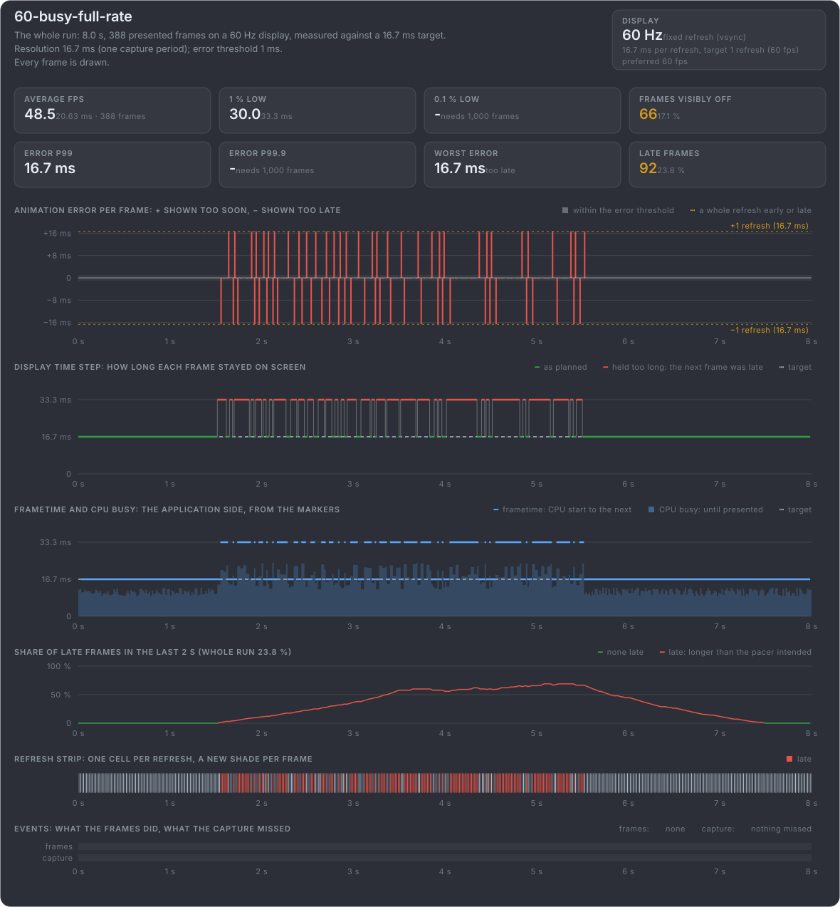
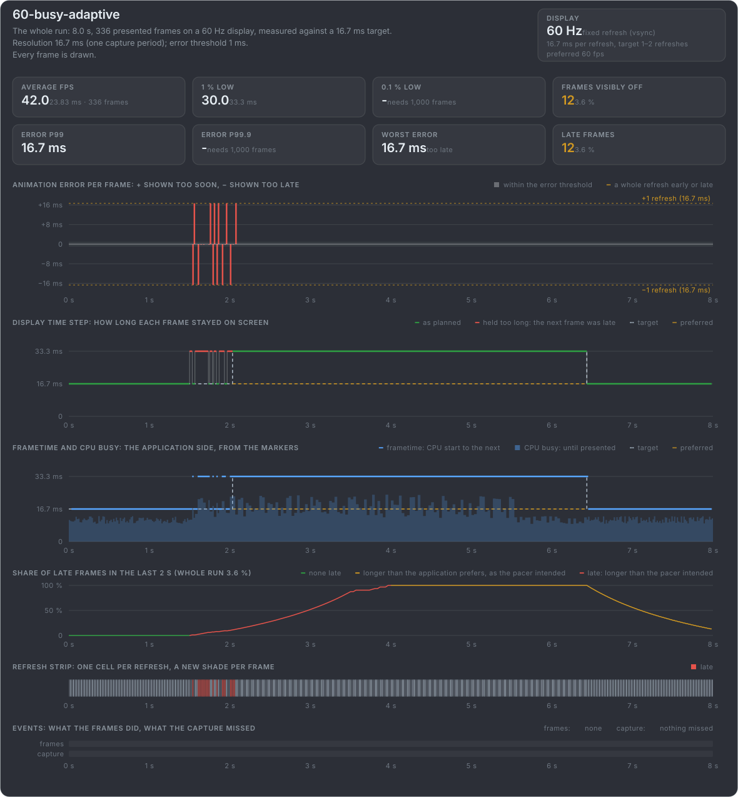

# Busy stretches: holding 60 fps, or a frame pacer lowering the rate

**Busy, full rate:** a stretch of work too heavy for 60 fps, and the game keeps aiming for 60: frames late all through it.

**Busy, the frame pacer lowers the rate:** a dozen frames late as the stretch begins, then the frame pacer drops to 30 fps for the
rest of it (like [the Swappy frame pacer](#/adapt-rate) on Android): below the 60 fps the game prefers, but as planned, not late.

