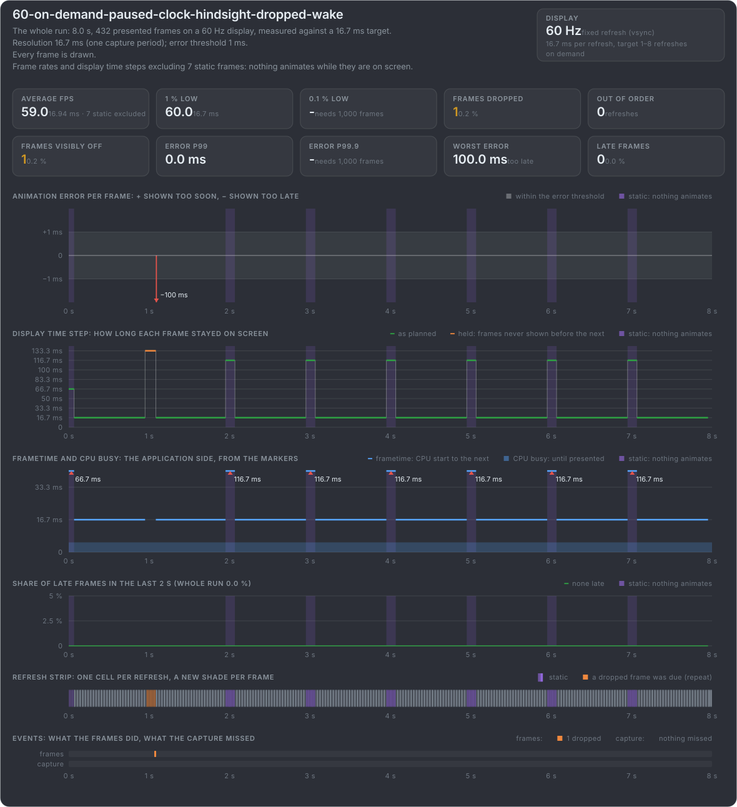
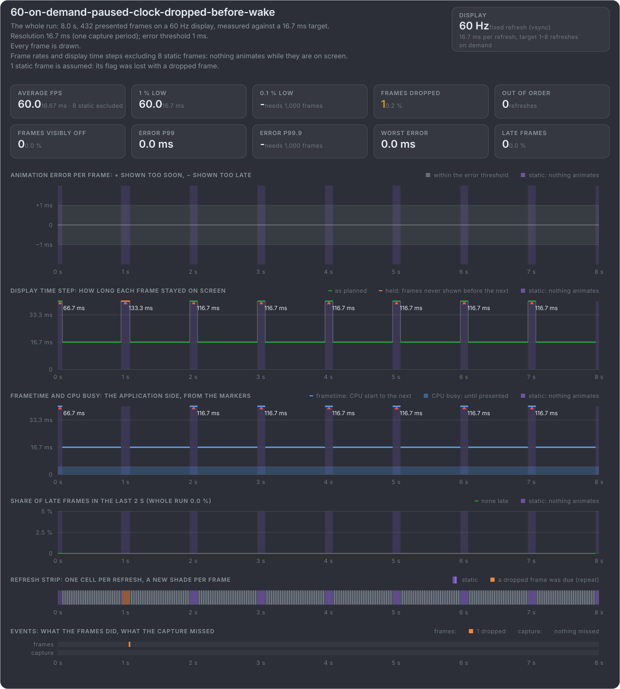
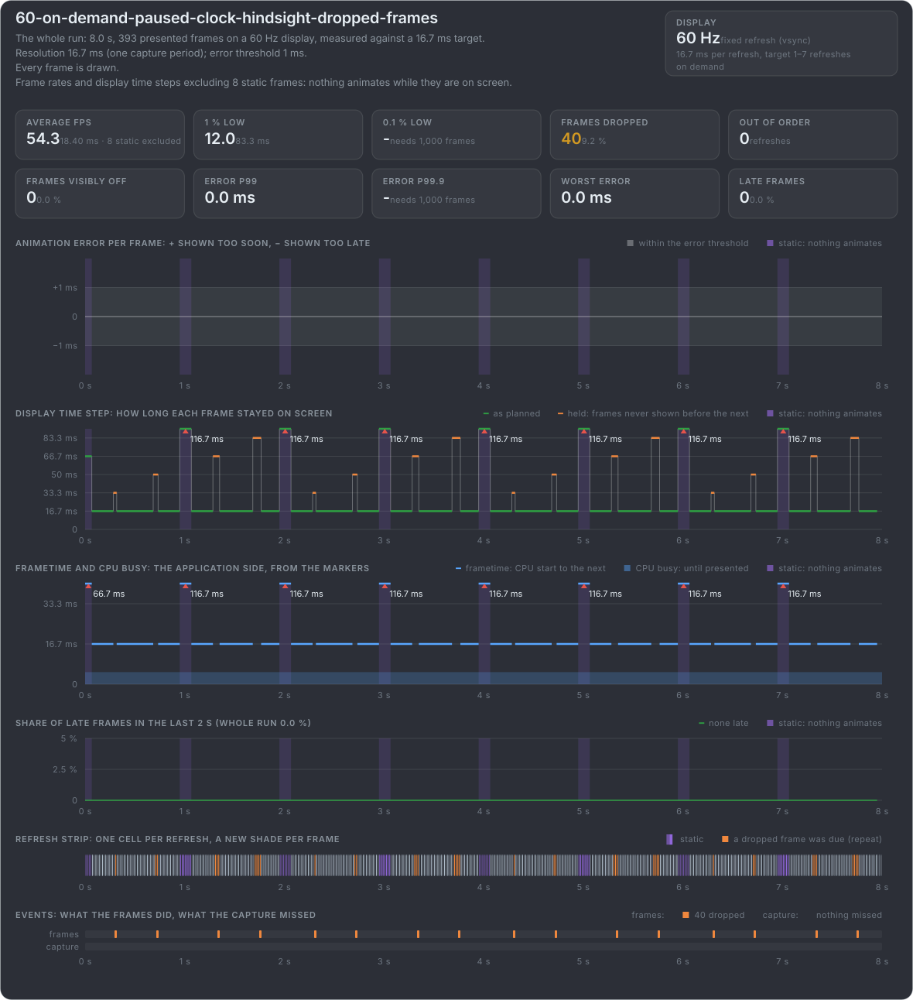
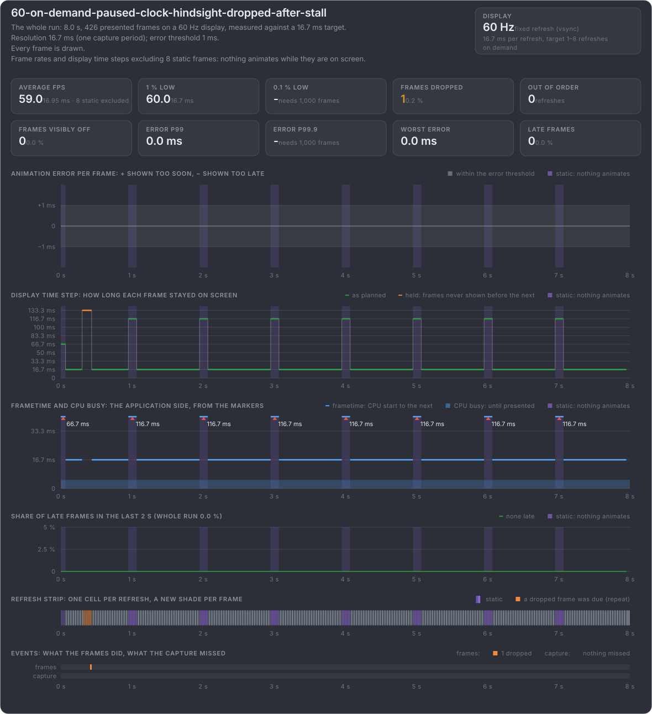

# When a static flag is lost

A static flag travels in one frame's marker. When that frame is dropped, the flag never reaches the display, or it arrives about a
frame nobody saw. Nothing then says the rest was static, and mb-framepacing judges the step across it. The first three clips lose the
flag each way; the last two look like a lost rest and are not one.

**The rest's frame dropped, flagged in hindsight:** the first rest's frame is rendered and never shown. The frame that wakes up says
static before about a frame nobody saw, so it marks nothing, and that step is judged: −100 ms. Every other rest stays unjudged.

**The wake-up frame dropped, flagged in hindsight:** here the frame that wakes up after the first rest is the one never shown. Its
static before flag never reaches the display, and the step across the rest is judged: −100 ms.

**The rest's frame dropped, flagged in advance:** the rest's frame carries static after itself and is never shown, so the flag is lost
with it. The frame before it holds the rest without a flag, and the step to the frame that wakes up is judged: −100 ms.

**Frames dropped in the motion:** 40 frames dropped in runs of 1 to 4 while the box moves. The frame before each run stays up to 83 ms,
but the clock ran on and the next frame shows the right moment: no animation error, and none of it is a rest.

**A stall, then a dropped frame:** in the middle of the motion the game renders nothing for 7 refreshes, and the next frame is dropped.
One frame stays 133 ms and one frame index is missing, exactly as with a dropped wake-up frame. But the clock ran on, and the next frame
is 8 frames further: no animation error. Only the animation time tells this stall from a rest.

