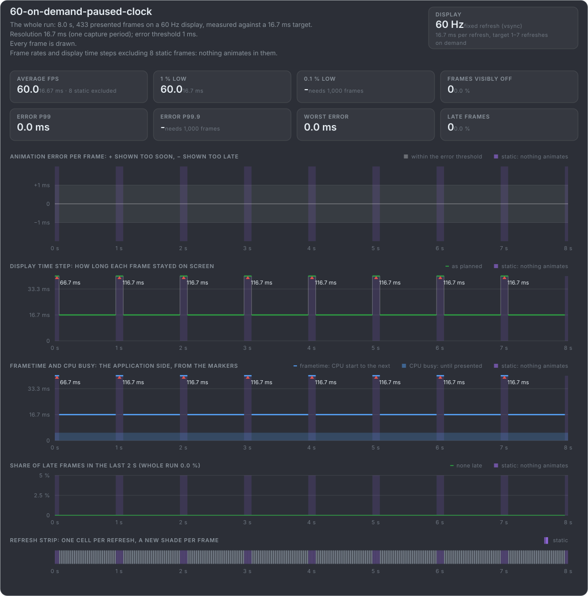
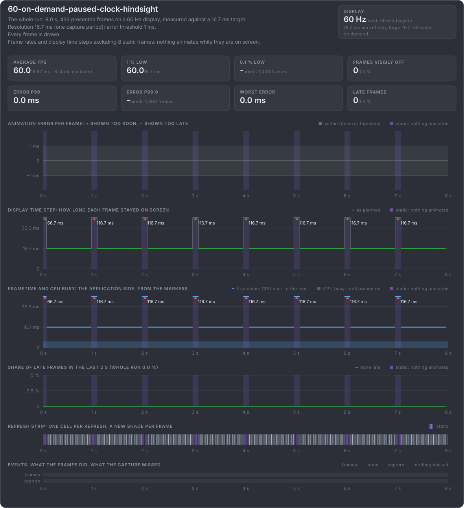
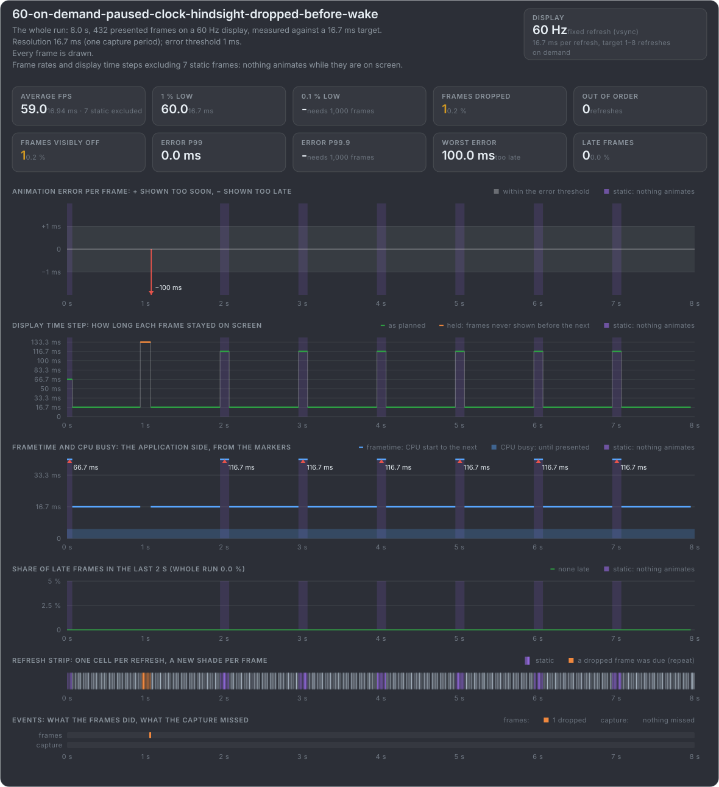
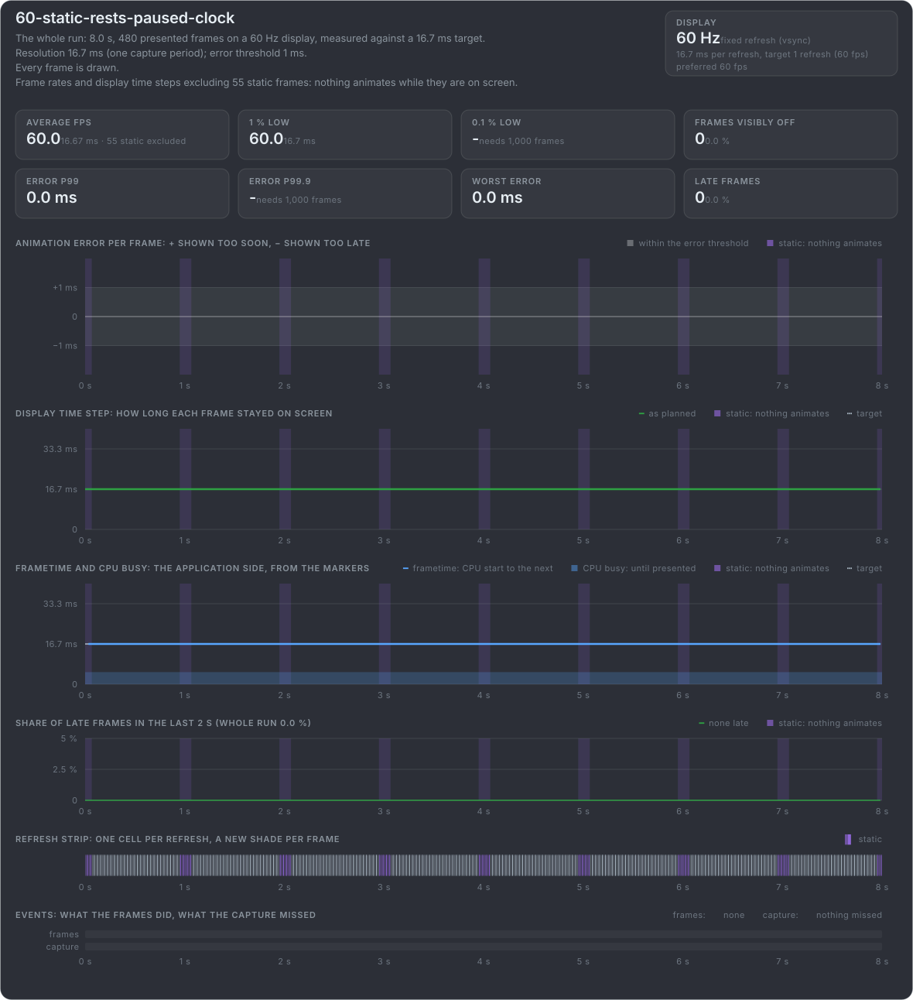

# The static flags: in advance or in hindsight

A frame is static when nothing animates while it is on screen. The app can say so on the frame itself (**static after**), when it
knows while rendering it, or on the next frame (**static before**), when it only knows once something wakes it up. Either way,
mb-framepacing does not judge the step from that frame to the next. That matters with an animation clock that stops while nothing
moves: the first moving frame would otherwise look as late as the rest was long.

**Flagged in advance:** a renderer that presents only when something changes, and whose animation clock stops while nothing moves. The
first moving frame after a rest would look 100 ms late, but the rest's frame says static after, so that step is not judged.

**Flagged in hindsight:** the same frames, but the rest's frame has no flag. The frame that wakes up says static before instead. The
card is the same, except at the very end: the run's last frame would get its flag from the frame after it, and the capture has ended by
then.

**A rest's frame dropped:** flagged in hindsight, but the first rest's frame is rendered and never shown. The frame that wakes up says
static before about a frame nobody saw, so it marks nothing, and that step is judged: −100 ms. Every other rest stays unjudged.

**Static rests, clock paused:** every frame is rendered while the box rests, and the clock stands still. The frame that reaches the rest
pose says static after; the frames inside the rest say both. The display steps on while the animation stands, which would be −16.7 ms
for every frame of a rest. The flags keep all of it from being judged, so the card stays flat.

[The static flags in the marker format](https://github.com/Unarmed1000/mb-framepacing/blob/master/sdk/doc/marker-format.md#flags)
{.more}
