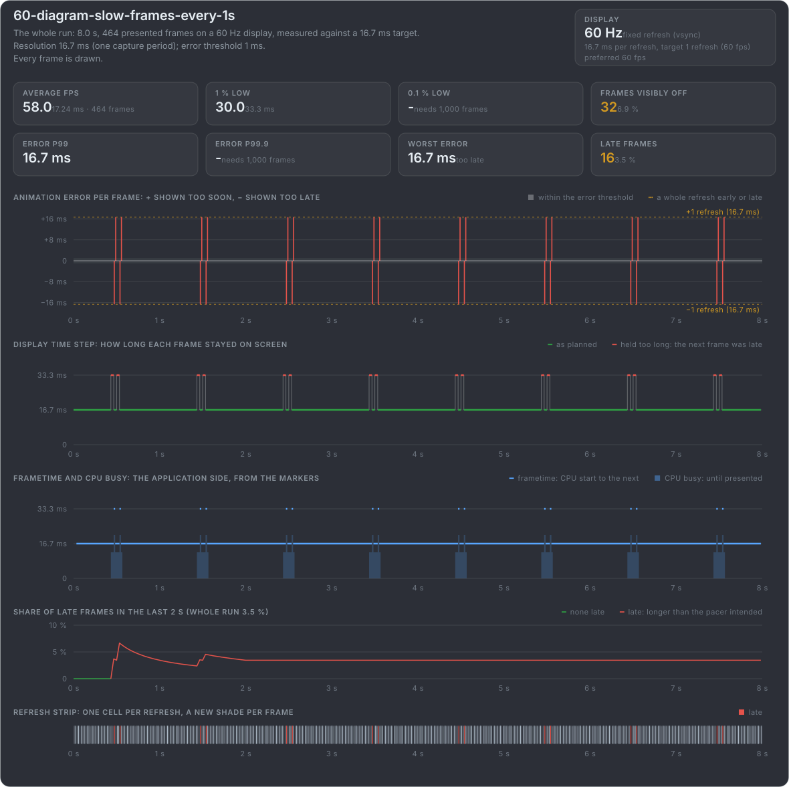
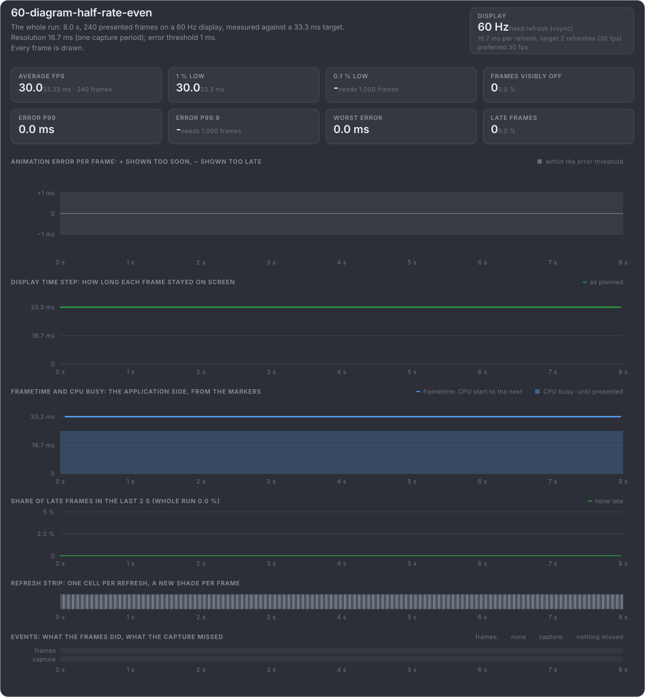
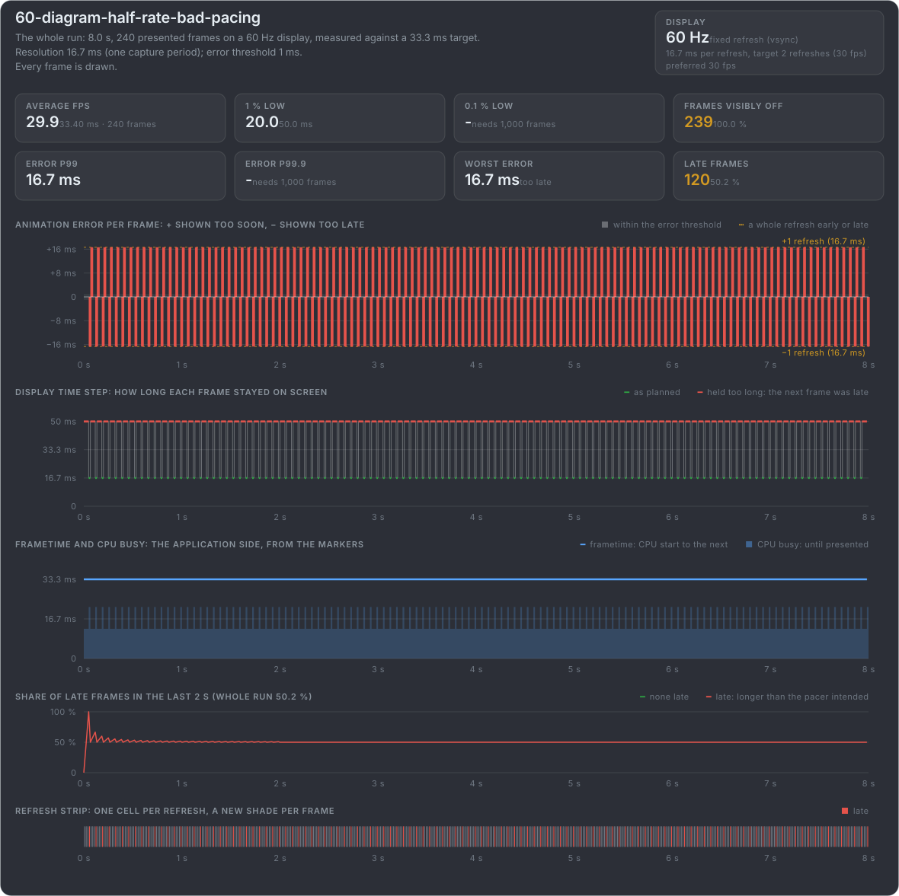
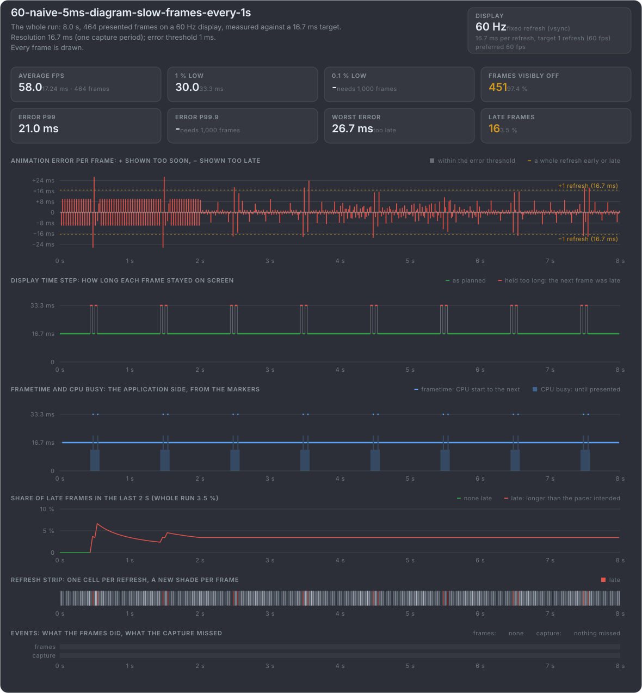
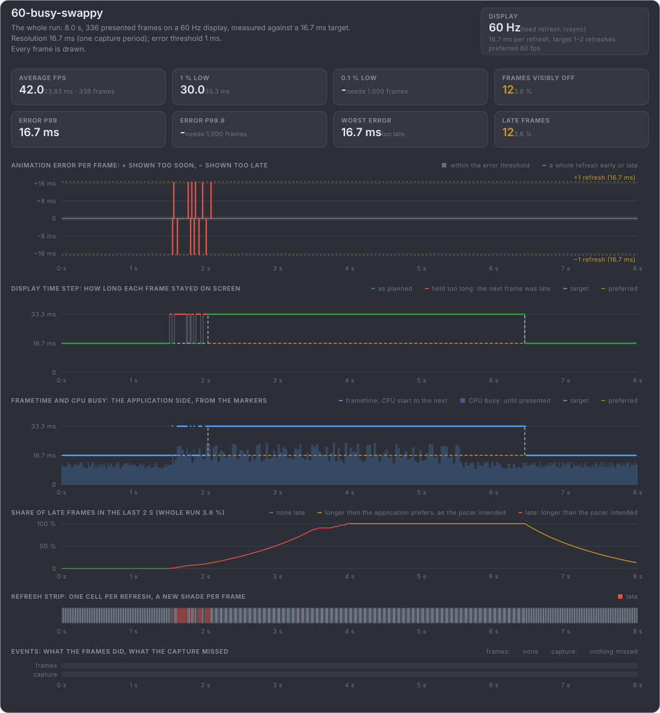
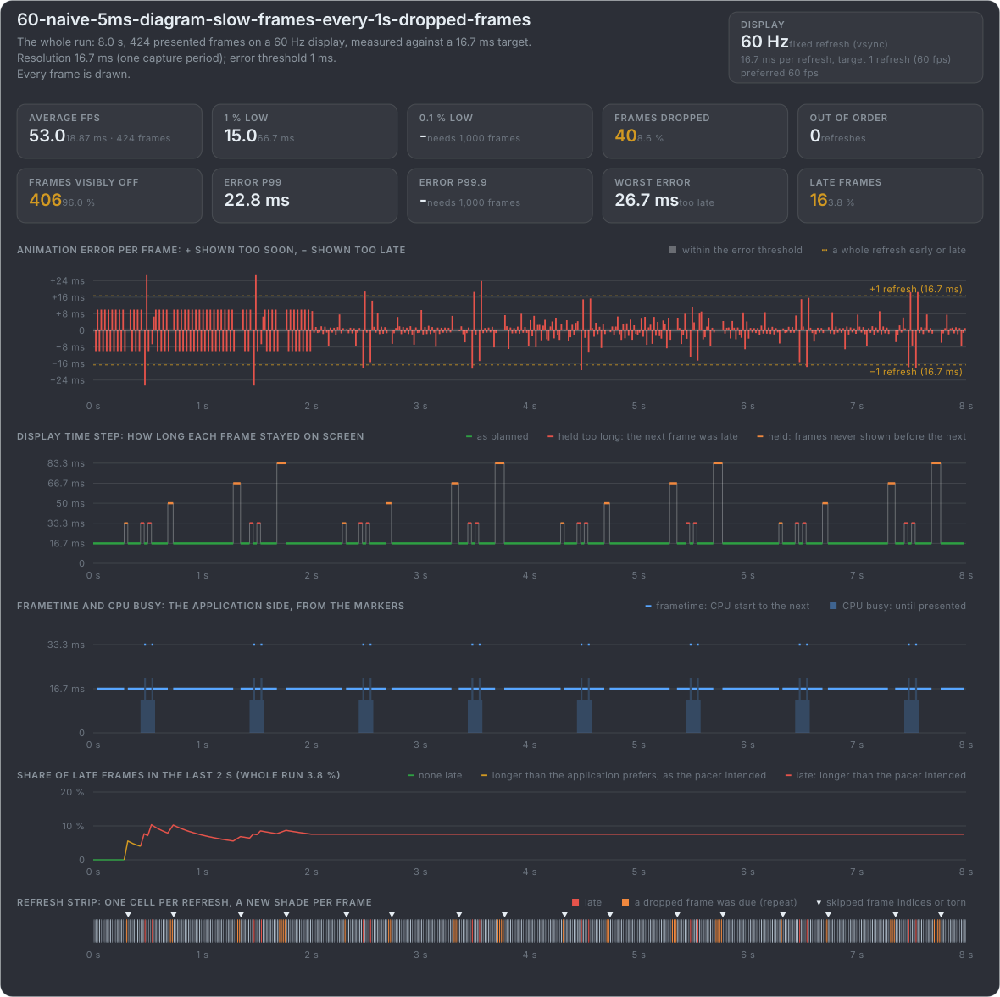
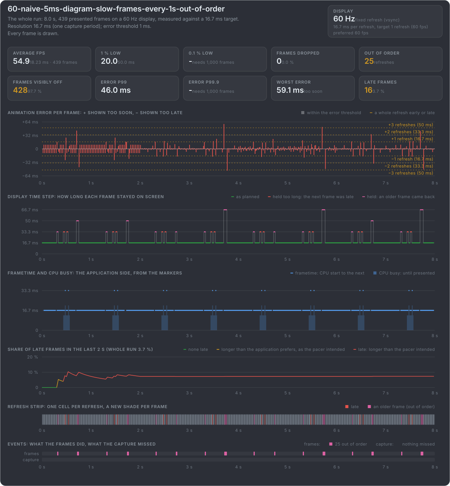
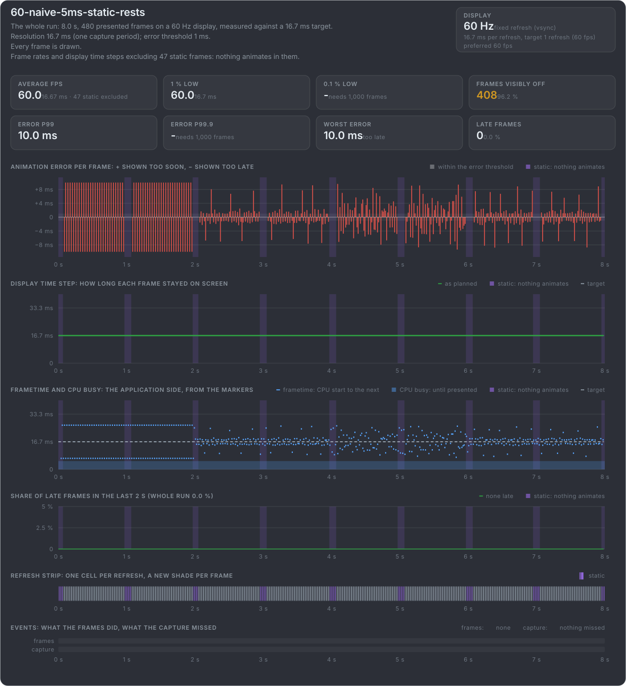
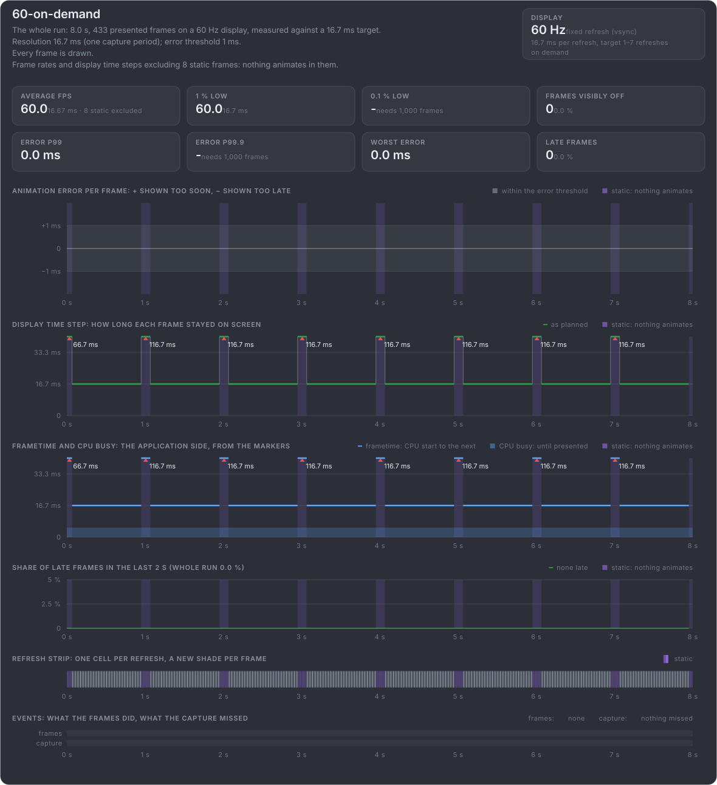
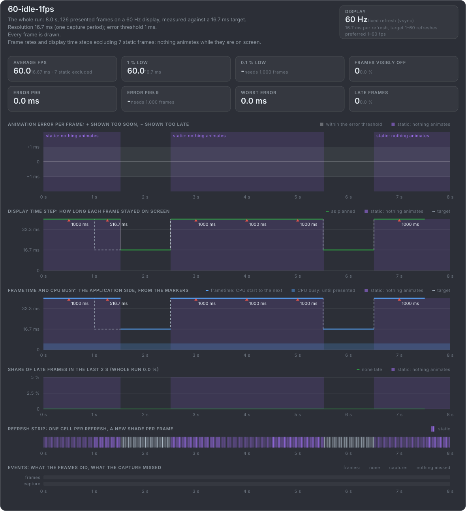

# What mb-framepacing reports for known problems

mb-framepacing tests itself against clips this project makes: the box of these slides with the marker in every frame, each clip
with one known problem and a manifest of every frame's truth. Here is each clip as mb-framepacing reports it, its default report
card for a capture of the video. Open a group to see its cards.

**The cards need the app's help:** these clips fill every field the marker has. Besides the frame index and animation time, that is
the pacer's plan (when it meant each frame to be shown, and the frame time it aims for and would prefer), when the CPU started each
frame and how long it worked on it, and a flag for frames where nothing moves. An app has to put these in its marker itself; each one
it leaves out, mb-framepacing does without. Lateness is then judged against a frame rate given to the tool, the frametime panel
stays empty, and a frame where nothing moves is judged like any other. {.note}

:::fold On time: the ideal timer, and delta time jitter

**60:** the ideal timer at 60 fps. Every frame on its own refresh, and no animation error: the flat baseline.

**30:** the ideal timer at 30 fps. Every frame held two refreshes, as the pacer planned, and still no animation error.

**60-naive-5ms:** a naive timer up to 5 ms off. The display time step stays flat while the animation error is everywhere: delta time
jitter.

:::

:::fold Late frames: missed refreshes and uneven half rate

**Slow frames:** twice a second a frame takes longer than a refresh to render and misses its refresh. The frame before is held 33 ms,
the late frame is a refresh behind and the next one catches up: 16 late frames, a steady 3.5 %.

**Half rate, even:** 30 fps on a 60 Hz display, every frame held two refreshes: slower, but even.

**Half rate, bad pacing:** the same 30 fps on average, but frames held one refresh, then three.

**The perfect storm:** the naive timer's jitter and the slow frames at once, as a real measurement usually shows them.

:::

:::fold Busy stretches: holding 60 fps, or a frame pacer lowering the rate

**Busy, full rate:** a stretch of work too heavy for 60 fps, and the game keeps aiming for 60: frames late all through it.

**Busy, the frame pacer lowers the rate:** a dozen frames late as the stretch begins, then the frame pacer drops to 30 fps for the
rest of it (like [the Swappy frame pacer](#/adapt-rate) on Android): below the 60 fps the game prefers, but as planned, not late.

:::

:::fold Dropped and out-of-order frames: rendered, but not shown as rendered

**Dropped frames:** the perfect storm with runs of 1 to 4 frames rendered but never shown. The frame before is held up to 83 ms and the
refresh strip marks the skipped frames, but the animation error stays small: the next frame shows the right moment, only late.

**Frames out of order:** the perfect storm with pairs and blocks of frames shown in the wrong order. Where the box goes back in time,
the animation error jumps both ways.

:::

:::fold Idle frames: static, on demand, or 1 fps at rest

**Static at rest:** the naive timer again, with the frames where the box rests marked static. Nothing moves there, so their jitter is
not judged.

**On demand:** nothing is presented while the box rests, so a frame stays up for several refreshes. There is no target frame time, so
none of it is late.

**On demand, paused clock:** the same, but the animation clock stops while nothing moves, so the first moving frame after a rest
would look 100 ms late. The static flag keeps that step from being judged.

**Idle at 1 fps:** a device saving power while the box rests three seconds: a frame a second, at the rate it wants then, so nothing
is late. Only the wait before the first moving frame counts as longer than the game prefers: that frame wants 60 fps again.

:::

[The test clips in mb-framepacing](https://github.com/Unarmed1000/mb-framepacing/tree/master/test-data/videos)
[How the clips are made](https://github.com/Unarmed1000/mb-framepacing-explained/tree/master/tools/frame_pacing_video#readme)
[What the marker can carry](https://github.com/Unarmed1000/mb-framepacing/blob/master/doc/marker-format.md#payload)
{.more}
