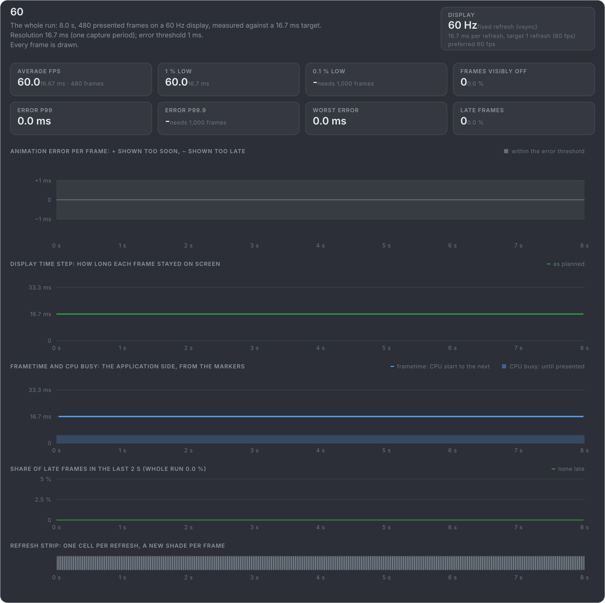
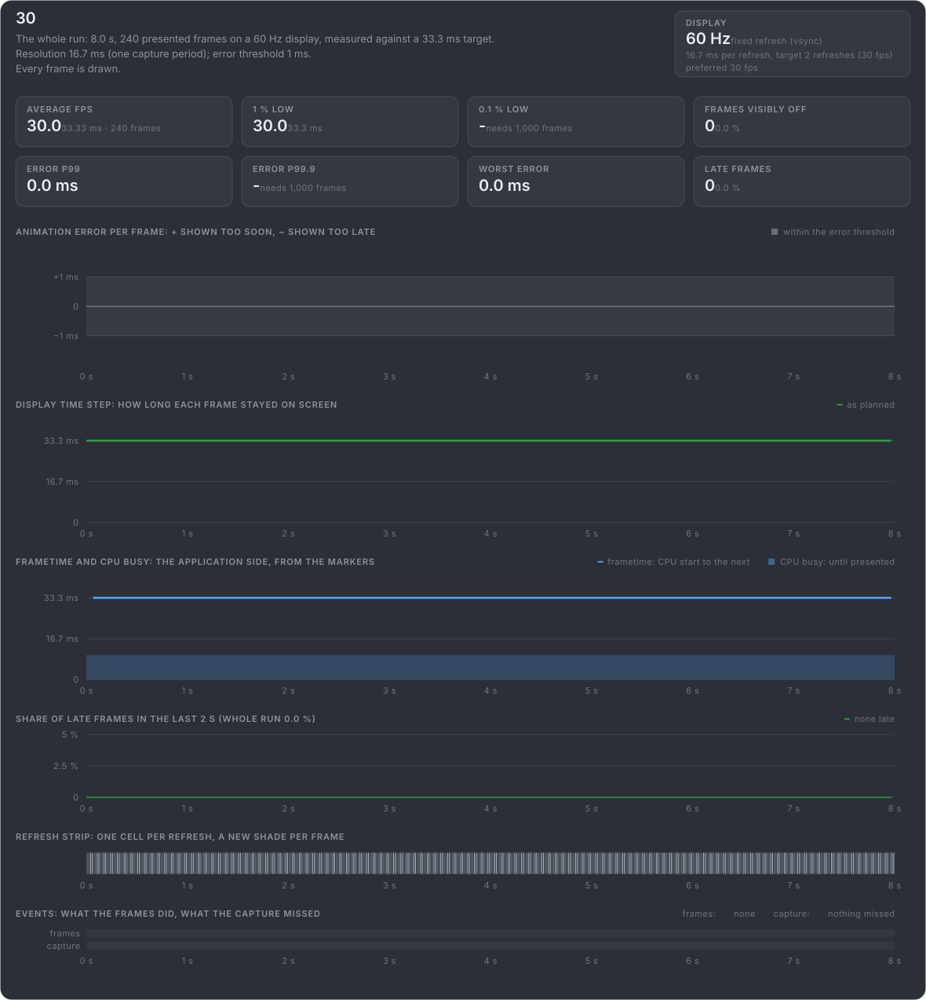
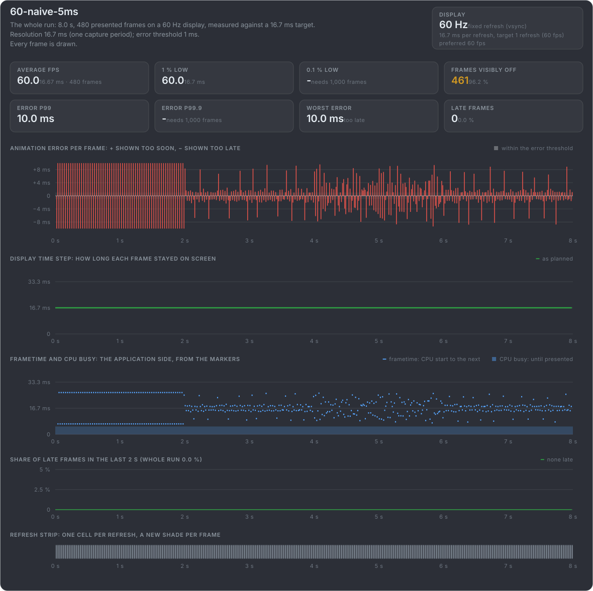

# What mb-framepacing reports for known problems

mb-framepacing tests itself against clips this project makes: the box of these slides with the marker in every frame, each clip
with one known problem and a manifest of every frame's truth. On this and the next four slides is each clip as mb-framepacing
reports it, its default report card for a capture of the video.

**The cards need the app's help:** these clips fill every field the marker has. Besides the frame index and animation time, that is
the pacer's plan (when it meant each frame to be shown, and the frame time it aims for and would prefer), when the CPU started each
frame and how long it worked on it, and a flag for frames where nothing moves. An app has to put these in its marker itself; each one
it leaves out, mb-framepacing does without. Lateness is then judged against a frame rate given to the tool, the frametime panel
stays empty, and a frame where nothing moves is judged like any other. {.note}

## On time: the ideal timer, and delta time jitter

**60:** the ideal timer at 60 fps. Every frame on its own refresh, and no animation error: the flat baseline.

**30:** the ideal timer at 30 fps. Every frame held two refreshes, as the pacer planned, and still no animation error.

**60-naive-5ms:** a naive timer up to 5 ms off. The display time step stays flat while the animation error is everywhere: delta time
jitter.

[The test clips in mb-framepacing](https://github.com/Unarmed1000/mb-framepacing/tree/master/test-data/videos)
[How the clips are made](https://github.com/Unarmed1000/mb-framepacing-explained/tree/master/tools/frame_pacing_video#readme)
[Filling the marker fields](https://github.com/Unarmed1000/mb-framepacing/blob/master/doc/marker-fields.md)
{.more}
