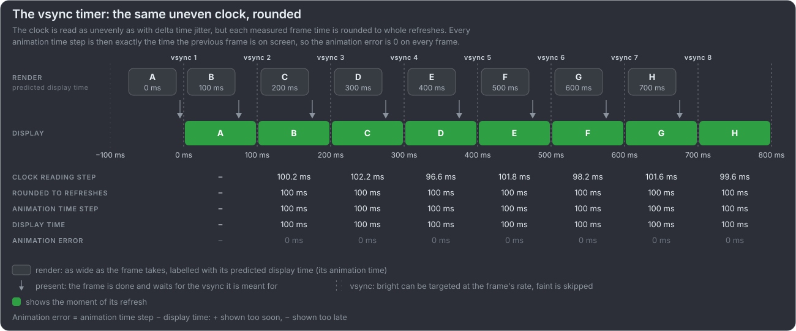

# Fix the animation time before the pacing

A game that renders its frames for the wrong moment has animation error on every frame, however well it paces them. On a fixed
refresh display with vsync on, every frame appears a whole number of refreshes after the previous one, so the animation time only
has to advance in whole refreshes. That needs no modern API or extension. It is for vsync on: with VRR (variable refresh rate,
G-SYNC or FreeSync: the display waits for each frame) or vsync off there is no refresh grid to round to, and they need other
solutions or the more modern APIs that report when frames appear.

:::guide

:::card The vsync timer

1. **Know the refresh period:** a hard-coded value to start, then the display mode where the platform reports it, or the average
   time between the loop's own frames (59.94 Hz is not 60 Hz).
2. **Measure the time since the previous frame** with the wall clock, as the naive timer does, and **round it to whole
   refreshes**: at least the swap interval, the refreshes each frame is held for (1 at full rate, 2 at [half rate](#/half-rate)).
3. **Render the frame for its predicted display time:** the previous frame's display time plus that many refreshes.

:::

:::card What it relies on

- Rounding removes wake-up jitter under **half a refresh**: 8.3 ms at 60 Hz, but only 2.1 ms at 240 Hz.
- A missed vsync still costs one late frame, but it shows up as a whole extra refresh in the next measurement, so the frame after
  it catches up exactly.
- Vsync on, a fixed refresh rate and a loop paced by vsync.
- **Watch for drift.** The timer counts refreshes, so it runs on the display's clock: take 60 Hz for a 59.94 Hz display and it is
  0.1 % off, about 3.6 s per hour. The picture stays smooth, but audio and a game server run on other clocks and slowly disagree.
  Measure the period over many frames and slew towards the clock that matters in tiny steps; paying it back in whole refreshes
  is a visible hitch.
- It is the perfect timer of every diagram here and the ideal timer of the videos.

:::

:::

[Getting the animation time right](https://github.com/Unarmed1000/mb-framepacing-explained/blob/master/doc/frame-pacing-strategies.md#first-get-the-animation-time-right)
[Vsync signals per platform](https://github.com/Unarmed1000/mb-framepacing-explained/blob/master/doc/frame-pacing-strategies.md#appendix-a-vsync-signals-per-platform)
[Drift](https://github.com/Unarmed1000/mb-framepacing-explained/blob/master/doc/frame-pacing-strategies.md#appendix-b-drift)
{.more}
